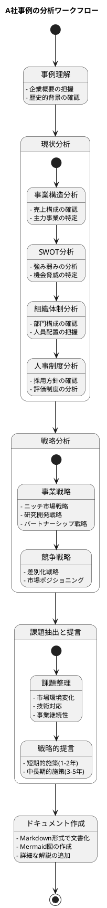

# 分析作業のワークフロー

```plantuml
@startuml
title A社事例の分析ワークフロー

[*] --> 事例理解
事例理解 : - 企業概要の把握\n- 歴史的背景の確認

state "現状分析" as Analysis {
    [*] --> 事業構造分析
    事業構造分析 : - 売上構成の確認\n- 主力事業の特定
    
    事業構造分析 --> SWOT分析
    SWOT分析 : - 強み弱みの分析\n- 機会脅威の特定
    
    SWOT分析 --> 組織体制分析
    組織体制分析 : - 部門構成の確認\n- 人員配置の把握
    
    組織体制分析 --> 人事制度分析
    人事制度分析 : - 採用方針の確認\n- 評価制度の分析
}

事例理解 --> Analysis
Analysis --> Strategy
state "戦略分析" as Strategy {
    [*] --> 事業戦略
    事業戦略 : - ニッチ市場戦略\n- 研究開発戦略\n- パートナーシップ戦略
    
    事業戦略 --> 競争戦略
    競争戦略 : - 差別化戦略\n- 市場ポジショニング
}

Strategy --> Issues
state "課題抽出と提言" as Issues {
    [*] --> 課題整理
    課題整理 : - 市場環境変化\n- 技術対応\n- 事業継続性
    
    課題整理 --> 戦略的提言
    戦略的提言 : - 短期的施策(1-2年)\n- 中長期的施策(3-5年)
}

Issues --> ドキュメント作成
ドキュメント作成 : - Markdown形式で文書化\n- Mermaid図の作成\n- 詳細な解説の追加

ドキュメント作成 --> [*]

@enduml
```