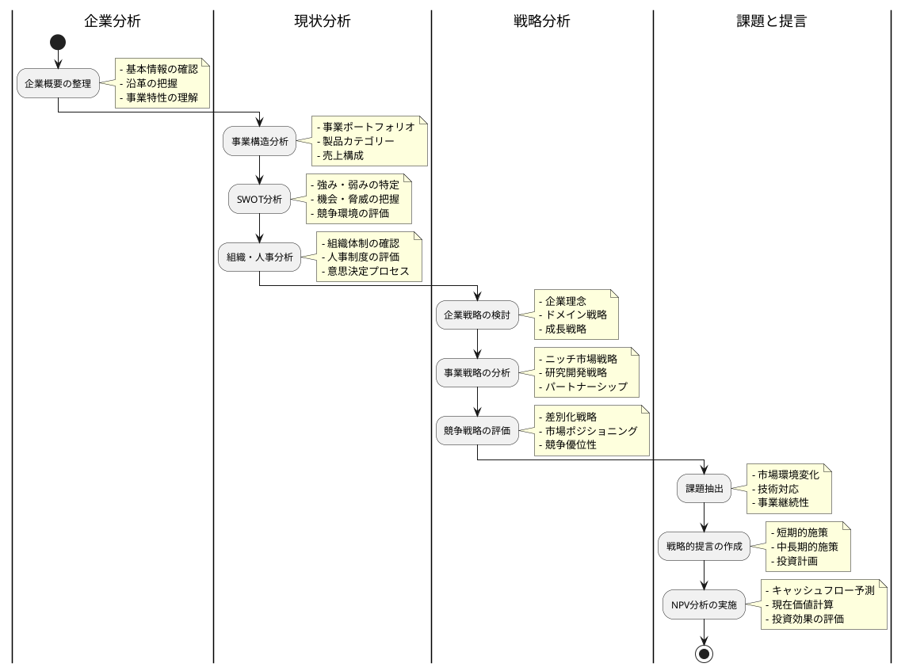
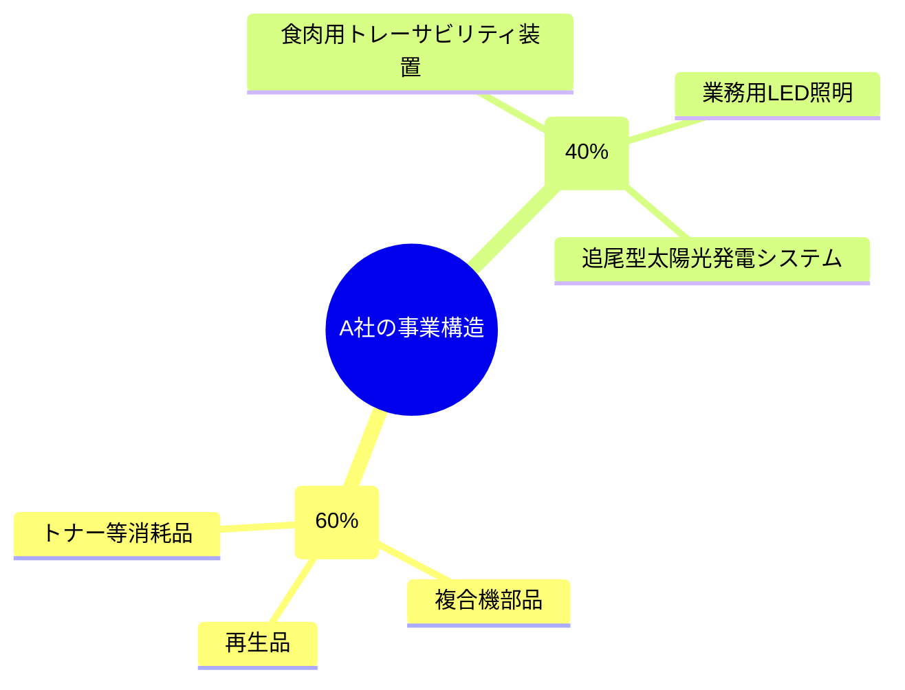
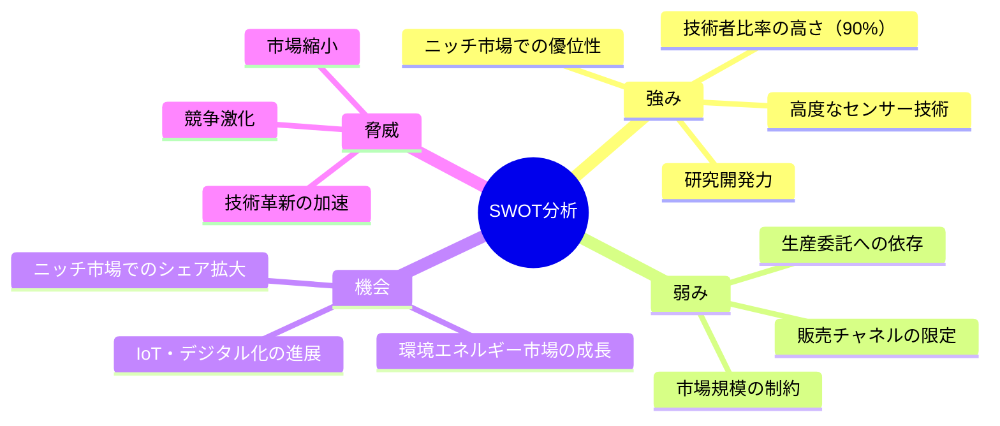
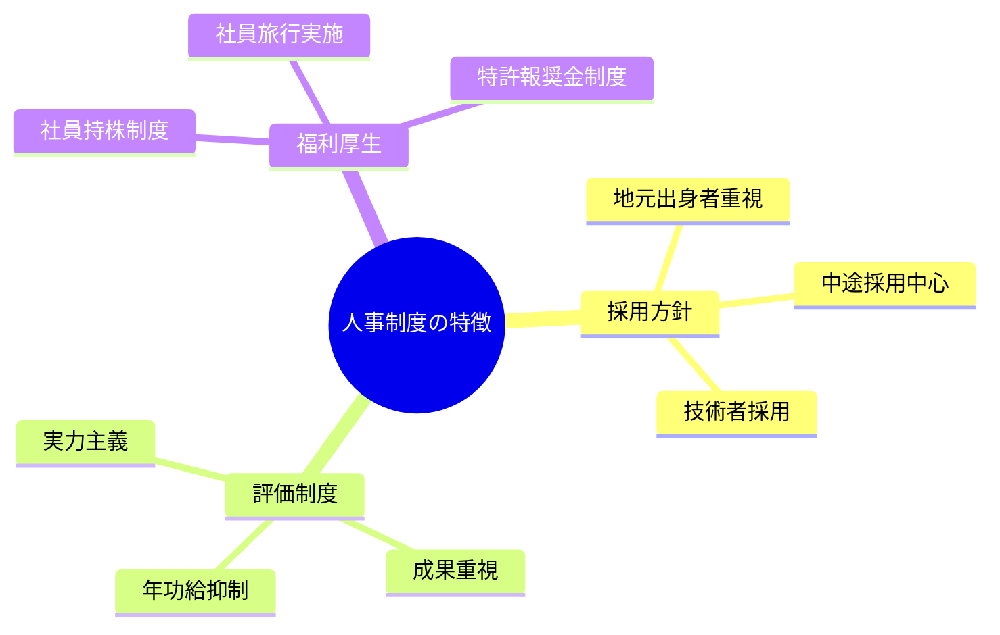
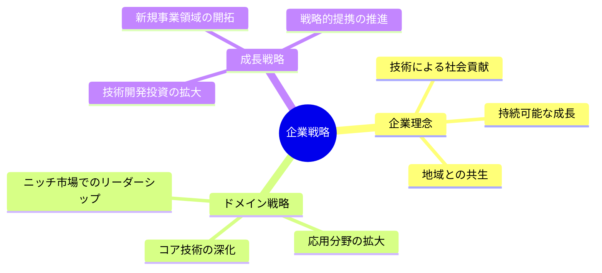
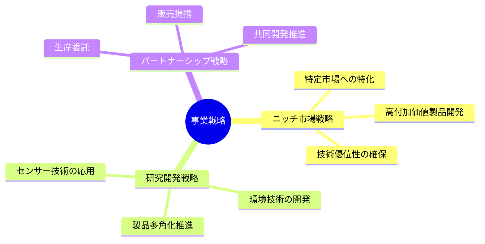
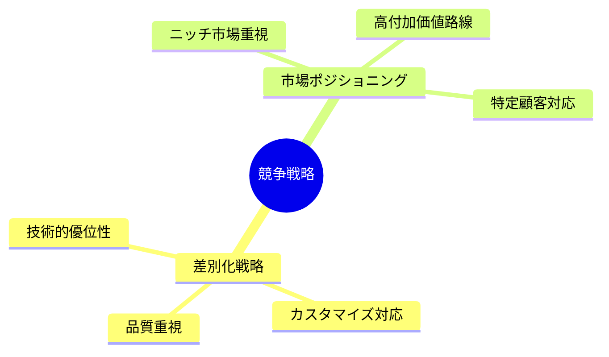
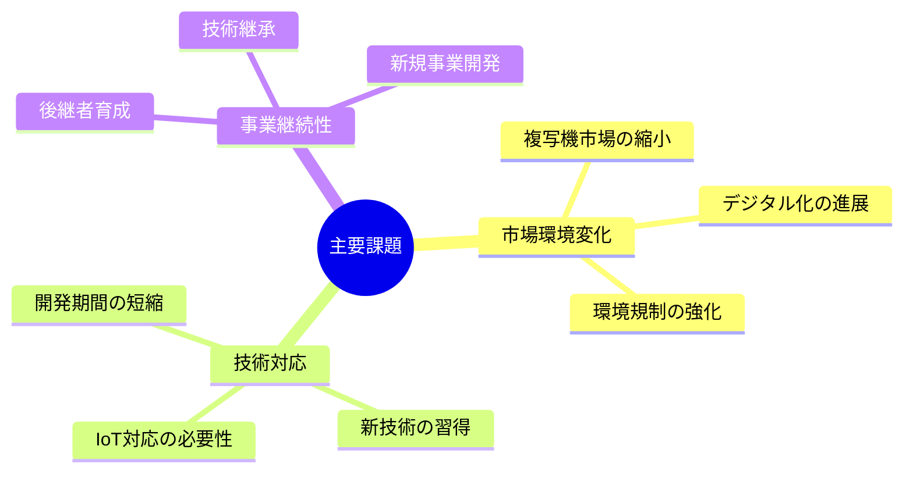
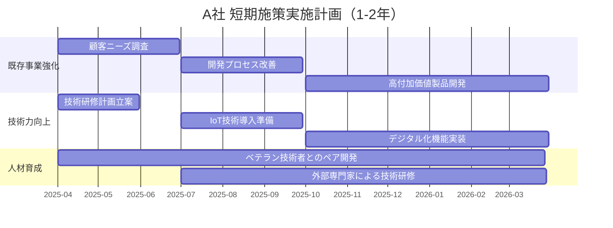
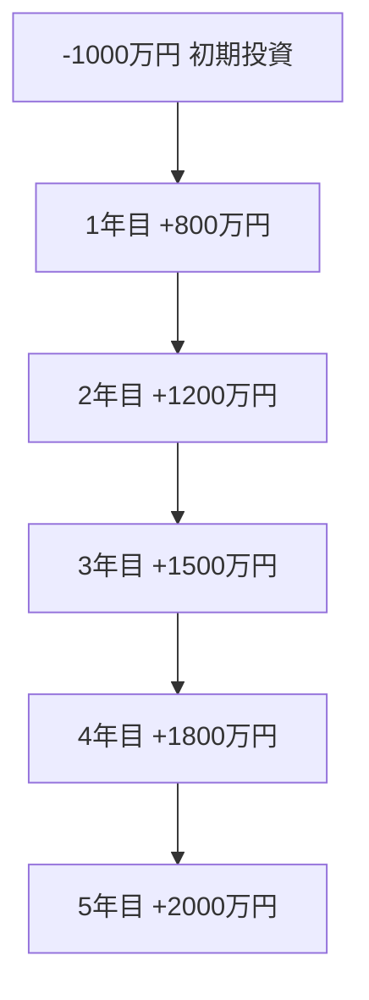

# A社の事例分析

## 分析プロセス

## 1. 企業概要

A社は、1970年代後半に設立された研究開発型のエレクトロニクスメーカーです。大手コンデンサーメーカー出身の現社長が、地域産業の発展を目指して創業しました。創業以来、センサー技術を核として事業を展開し、ニッチ市場で独自のポジションを確立してきました。産学連携にも積極的で、地元大学との共同研究も複数実施しています。

以下に主要な特徴を示します：

- 資本金：2500万円
- 売上規模：約12億円（直近5年間は年平均2%の成長）
- 従業員構成：約50名（役員5名除く）
  - 技術系：45名（うち博士号取得者3名）
  - 事務系：5名
  - 平均年齢：42.5歳
- 事業特性：研究開発中心の企業（研究開発費は売上の約15%）
- 主力事業：電気機器開発（生産・販売は委託）
- 知的財産：特許保有数20件以上（国内17件、海外3件）

## 2. 現状分析

### 2.1 事業構造

A社の事業構造は、長年の技術蓄積と市場ニーズの変化に応じて進化してきました。創業当初は部品供給が主体でしたが、自社開発製品へとシフトし、現在は以下の2つの事業領域を柱としています。複写機関連製品は安定した収益源となっていますが、成長性は限定的です。一方、独自開発製品は成長率が高く（年率8%増）、今後の主力になると期待されています。

各製品カテゴリーの特徴：
- **複写機関連製品**: 大手OA機器メーカーとの長期取引関係に基づく安定事業
- **食肉用トレーサビリティ装置**: 食品安全規制強化を背景に需要増加中
- **業務用LED照明**: 省エネ性能が業界トップクラス、主に工場や倉庫向け
- **追尾型太陽光発電システム**: 独自の追尾アルゴリズムにより発電効率15%向上

### 2.2 SWOT分析

A社の現状を総合的に評価するため、以下のSWOT分析を実施しました。この分析から、技術力を核とした強みと、市場環境の変化がもたらす課題が明確になっています：

**強み分析の詳細**:
- 高度なセンサー技術は20年以上の研究蓄積に基づいている
- 研究開発力の源泉は少数精鋭の技術者チームと柔軟な組織風土
- 小規模市場では大手が参入しにくいため、技術的優位性を維持しやすい

**弱み分析の詳細**:
- 生産委託先は3社に限定されており、生産能力に制約がある
- 直接販売が中心で、流通網の広がりに欠ける
- 各製品市場の規模は数十億円程度と小さい

**外部環境の詳細分析**:
- 2050年カーボンニュートラルへの動きが環境関連市場を押し上げている
- センサーとIoTの融合が新たな用途を生み出している
- 大手メーカーはニッチ市場からの撤退傾向があり、シェア拡大の余地がある

### 2.3 組織体制

組織体制は、効率的な製品開発と品質管理を実現するため、以下の3部門を中心に構成されています。各部門は役員が直接統括し、迅速な意思決定を可能にしています。組織の特徴としては、階層が少なく（最大でも3階層）、部門間の壁が低いことが挙げられます。これにより柔軟な人材配置と迅速なプロジェクト立ち上げが可能になっています。

- 製品開発部門（30名）
  * 環境エネルギー開発グループ（10名）
  * 精密機械開発グループ（12名）
  * LED照明開発グループ（8名）
- 品質管理部門（10名）
  * 品質保証チーム
  * 試験評価チーム
- 生産技術部門（10名）
  * 委託先管理チーム
  * 技術支援チーム

意思決定プロセスの特徴:
- 製品開発会議（週1回）: 各開発グループのリーダーが参加
- 経営会議（月1回）: 役員と部門長が参加
- 全体会議（四半期に1回）: 全社員が参加し、経営方針の共有と意見交換を実施

### 2.4 人事制度

A社の人事制度は、技術者重視の採用方針と実力主義的な評価制度を基盤としながら、従業員の帰属意識を高める福利厚生施策を組み合わせた特徴的なものとなっています。社員の平均勤続年数は12.5年で、業界平均を上回る定着率を示しています。

人事制度の特徴と効果:
- **採用**: 地元の工業高校や大学からの採用を重視しており、地域との結びつきが強い
- **評価**: 半期ごとの目標管理制度を導入し、達成度に応じた賞与支給を実施
- **報酬**: 基本給と業績連動型賞与の組み合わせ、特許取得者には特別手当を支給
- **キャリアパス**: 専門職コースとマネジメントコースの2軸で設定

## 3. 戦略分析

### 3.1 企業戦略

A社の企業戦略は、技術力を核とした持続可能な成長モデルの構築を目指しています。以下に主要な戦略要素を示します：

戦略の詳細：

1. **企業理念に基づく経営**
   - 技術を通じた社会課題解決への貢献
   - 地域経済への貢献（地元採用、産学連携）
   - 環境配慮型製品の開発推進

2. **事業ドメインの設定**
   - センサー技術を核とした製品開発
   - 環境・エネルギー分野への注力
   - ニッチ市場での競争優位性確保

3. **成長戦略の推進**
   - 研究開発投資の拡大（売上高比18%へ）
   - 医療・ヘルスケア分野など新規市場開拓
   - 大学・研究機関との連携強化

### 3.2 事業戦略

A社の事業戦略は、高度な技術力を活かしたニッチ市場での優位性確保を基本として、以下の3つの戦略軸で展開されています。過去5年間の戦略実行により、独自開発製品の売上比率は25%から40%に上昇しました。

各戦略の詳細と実施状況:
- **ニッチ市場戦略**: 食肉トレーサビリティ市場では40%のシェアを獲得
- **研究開発戦略**: センサー技術の応用範囲を拡大し、医療・ヘルスケア分野への展開を検討中
- **パートナーシップ戦略**: 大学との共同研究を2件実施中、地元企業とのネットワークを活用

中期経営計画（3年）の主要目標:
- 売上高15億円達成（年率8%成長）
- 独自開発製品の売上比率50%へ引き上げ
- 新規事業分野（医療・ヘルスケア）への参入

### 3.2 競争戦略

市場環境の変化に対応しつつ、自社の強みを最大限に活かすため、以下の競争戦略を展開しています。A社はコスト競争ではなく、差別化による競争優位性の確立を目指しています。

競争戦略の実践事例:
- **差別化**: 追尾型太陽光発電システムは独自のアルゴリズムにより競合製品より15%高い発電効率を実現
- **カスタマイズ**: 顧客の個別要件に対応した製品カスタマイズにより顧客満足度向上（顧客満足度調査で90%以上の満足評価）
- **ニッチ市場**: 大手が参入しない市場規模50億円以下の市場を中心に展開

主要競合との差別化ポイント:
- 技術特化型の研究開発体制
- 迅速な意思決定と製品開発サイクル
- 顧客との緊密なコミュニケーションによる要件把握

## 4. 課題と提言

### 4.1 現状の課題

A社が直面している主要な課題は、市場環境の変化、技術革新への対応、事業継続性の確保の3つの観点から整理できます。これらの課題は相互に関連しており、包括的な対応が必要です。

課題の詳細分析:
- **複写機市場の縮小**: 主力の複写機関連製品市場は年率3%で縮小しており、代替事業の育成が急務
- **デジタル化対応**: 製品のスマート化、クラウド連携機能の要求が増加している
- **技術革新**: AIやビッグデータ分析など、新技術の習得と製品への実装が必要
- **人材課題**: 技術者の高齢化（45歳以上が40%）により、技術継承が課題
- **新規事業開発**: 成長市場への参入には投資資金と人材確保が必要

課題間の相関関係:
- 市場縮小に対応するための新規事業開発には技術革新への対応が必須
- 技術継承と後継者育成は新技術習得の基盤となる

### 4.2 戦略的提言

A社の持続的成長を実現するため、短期的施策と中長期的施策の両面から戦略的提言を行います。各提言は現状分析と課題認識に基づいています。

#### 4.2.1 短期的施策（1-2年以内に実施）

1. 既存事業の強化
   - 複写機関連製品の高付加価値化（例：環境配慮型材料への転換、リサイクル性向上）
   - 顧客ニーズの深堀り（例：主要顧客への定期訪問プログラム実施、顧客の声を製品開発に反映する仕組み構築）
   - 効率的な開発プロセスの確立（例：プロトタイピング手法の導入、設計・開発ツールの最新化）

2. 技術力の向上
   - IoT技術の導入（例：センサーデータのクラウド連携機能開発、データ分析基盤構築）
   - デジタル化対応（例：既存製品へのネットワーク機能追加、リモートモニタリング機能実装）
   - 若手技術者の育成（例：ベテラン技術者とのペア開発制度導入、外部専門家による技術研修実施）

具体的な実施スケジュール:

主要マイルストーン:
- 第1四半期(2025/4-6): 顧客ニーズ調査、技術研修計画立案
- 第2四半期(2025/7-9): 開発プロセス改善、IoT技術導入準備
- 第3-4四半期(2025/10-2026/3): 高付加価値製品プロトタイプ開発、デジタル化機能実装

#### 4.2.2 中長期的施策（3-5年の期間で実施）

1. 新規事業展開
   - 環境エネルギー分野の拡大（例：蓄電システムとの連携強化、エネルギーマネジメントシステム開発）
   - IoT関連製品の開発（例：産業用IoTセンサーネットワークの構築、予知保全システムの開発）
   - グローバル市場への展開（例：東南アジア市場をターゲットとした製品開発、海外販売代理店の開拓）

2. 組織体制の強化
   - 技術継承システムの確立（例：技術ナレッジベースの構築、コア技術のドキュメント化）
   - 研究開発体制の整備（例：オープンイノベーション推進室の設置、外部研究機関との連携強化）
   - 人材育成プログラムの充実（例：キャリアパス制度の明確化、次世代リーダー育成プログラムの実施）

投資計画と期待効果:

1. 投資計画概要
   - 研究開発投資: 売上の15%→18%へ引き上げ（年間約3,600万円増）
   - 人材育成投資: 年間1,000万円（外部研修、資格取得支援等）
   - 期待効果: 5年後の売上高20億円達成、営業利益率12%実現

2. 人材育成投資のNPV分析（資本コスト6%）

NPV分析表:

| 年度 | キャッシュフロー | 割引率(6%) | 現在価値 | 主な効果 |
|------|--------------|------------|---------|---------|
| 0年目 | -1,000万円 | 1.000 | -1,000万円 | 初期投資（研修プログラム構築、教材開発） |
| 1年目 | +800万円 | 0.943 | +755万円 | ・基礎的な生産性向上(5%増) ・離職率低下(2%改善) |
| 2年目 | +1,200万円 | 0.890 | +1,068万円 | ・生産性向上(10%増) ・新規案件獲得開始 |
| 3年目 | +1,500万円 | 0.840 | +1,260万円 | ・生産性向上(15%増) ・技術継承の進展 |
| 4年目 | +1,800万円 | 0.792 | +1,428万円 | ・若手の戦力化 ・新規事業の本格化 |
| 5年目 | +2,000万円 | 0.747 | +1,495万円 | ・組織全体の技術力向上 ・新規事業の収益化 |
| **合計** | **+6,300万円** | - | **+5,006万円** | **投資回収期間：2.5年** |

投資効果の定量的評価:

| 効果項目 | 年間効果額 | 5年間累計 | 備考 |
|---------|-----------|-----------|------|
| 生産性向上 | 600-800万円 | 3,000万円 | 技術者一人当たり生産性が年率15%向上 |
| 新規事業収益 | 400-800万円 | 2,500万円 | 3年目から本格的に収益貢献 |
| コスト削減 | 200万円 | 800万円 | 離職率低下による採用・教育コスト削減 |
| **合計** | **1,200-1,800万円** | **6,300万円** | **ROI = 530%** |

## 5. 結論

A社は、創業以来40年以上にわたり、高い技術力と柔軟な事業展開により、ニッチ市場で強みを発揮してきました。しかし、デジタル化の進展や市場環境の変化により、新たな転換点を迎えています。既存事業の縮小に対応しつつ、新たな成長分野への展開が求められています。

今後の持続的成長を実現するためには、以下の点に注力することが重要です：

1. 技術優位性の維持・強化（センサー技術とIoT・AIの融合）
2. 新規事業領域の開拓（環境エネルギー、医療・ヘルスケア分野）
3. 人材育成と技術継承（知識共有システムの構築と若手育成）
4. デジタル化への積極的対応（全製品のネットワーク対応）

これらの取り組みを通じて、A社は研究開発型企業としての特徴を活かしながら、新たな成長機会を捉えることが可能となります。技術と人材を基盤とした持続的成長モデルの構築により、地域に根差したグローバル・ニッチトップ企業を目指すことを提言します。
