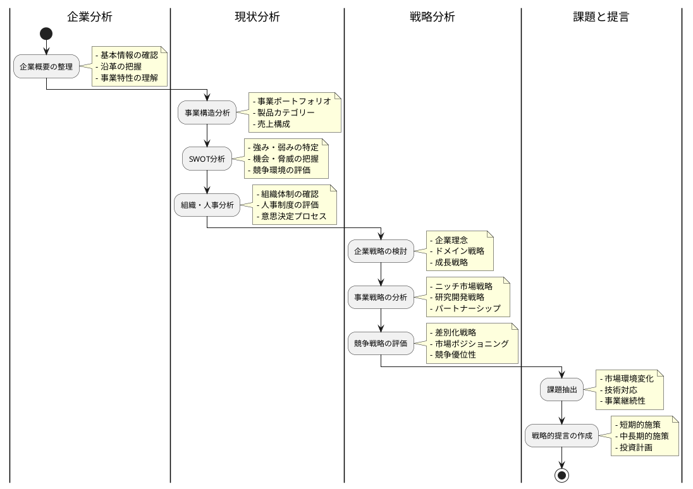
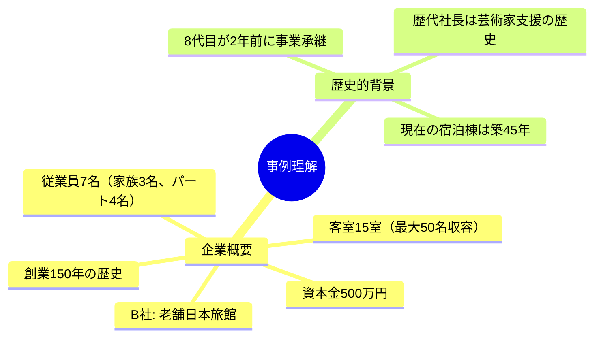
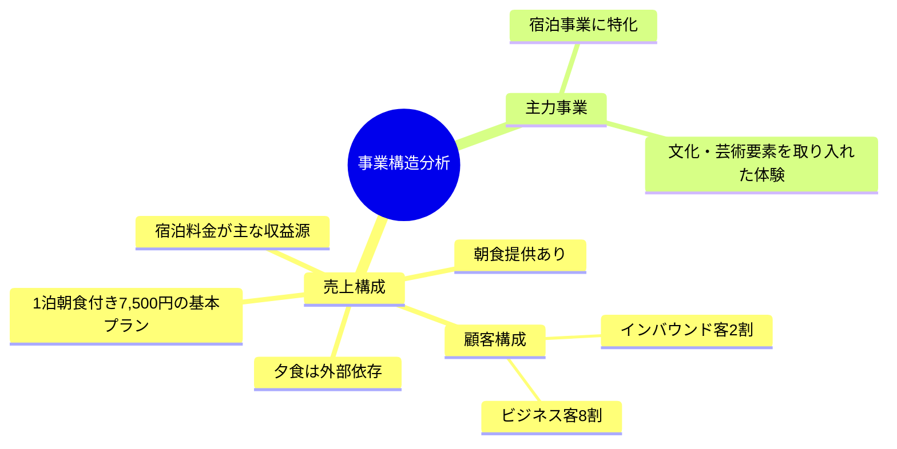
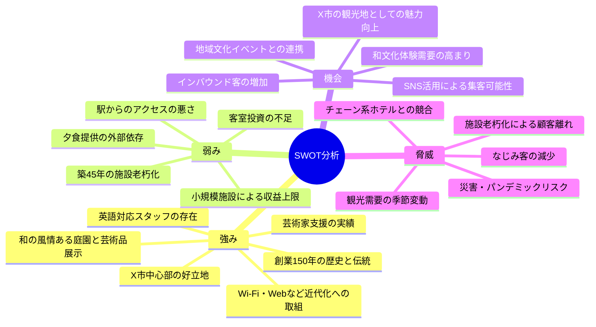
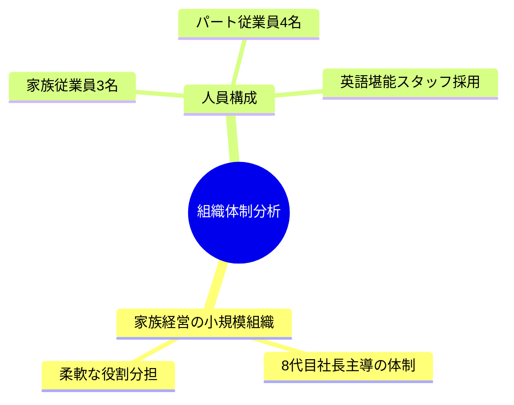
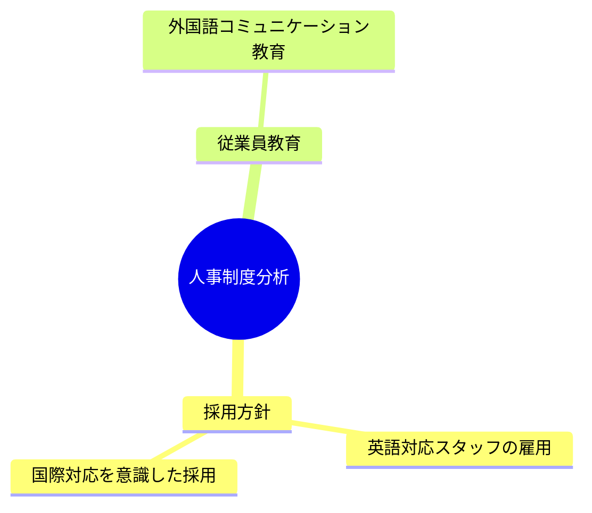
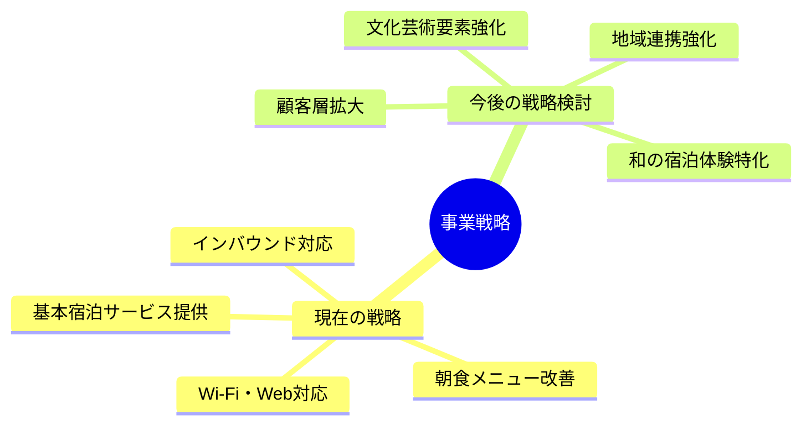
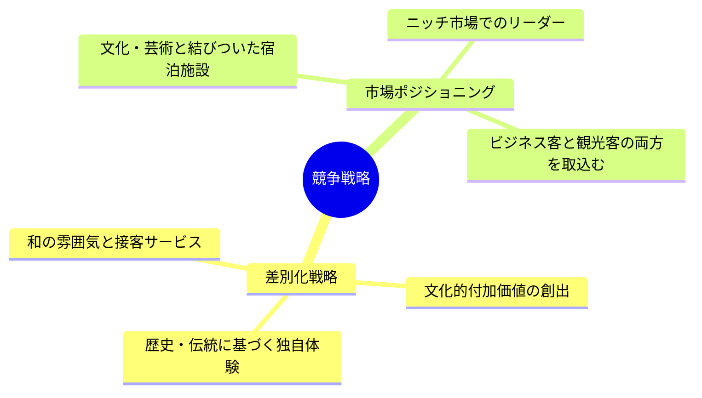
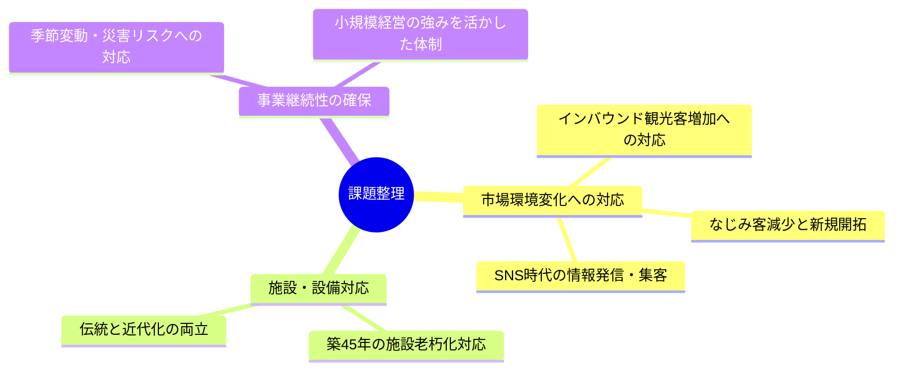
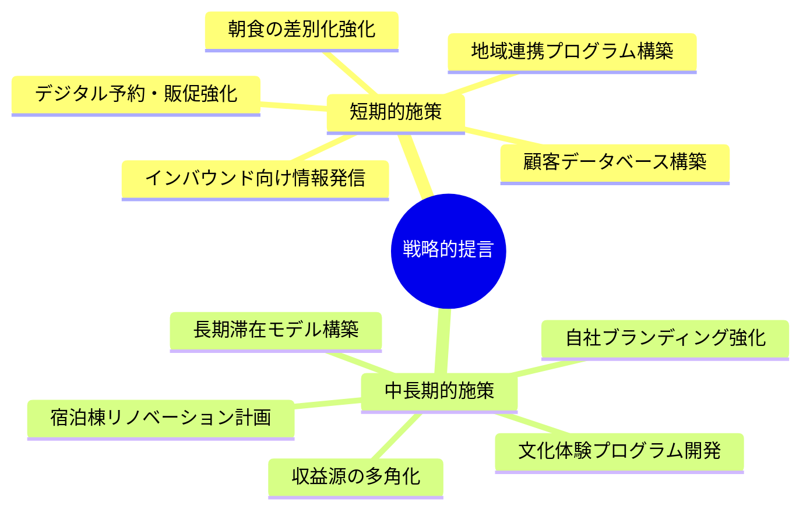

# B社の事例分析

## 分析プロセス

## 事例理解

### 企業概要
- **企業名**: B社（老舗日本旅館）
- **設立**: 明治初期（約150年の歴史）
- **所在地**: X市市街地中心部
- **資本金**: 500万円
- **従業員**: 家族従業員3名、パート従業員4名（うち1名は英語堪能）
- **事業内容**: 宿泊事業（客室15室、最大収容人員50名）
- **主要設備**: 客室、大広間、庭園、駐車場（大型バス1台、乗用車6台分）

### 歴史的背景
- 約150年の歴史を持つ老舗旅館
- 2年前に父親（先代社長）が急死し、30歳代後半の長男が8代目社長として事業継承
- 歴代社長は芸術や文化への造詣が深く、芸術家を支援してきた経緯あり
- 現在の宿泊棟は築45年で、基本的に客室には手を加えていない

## 現状分析

### 事業構造分析

#### 売上構成
- 宿泊料金が主な収益源（1人1泊朝食付き7,500円が基本プラン）
- 朝食提供あり、夕食は外部の割烹料理店からの仕出しで対応
- 宿泊客の構成は昔なじみのビジネス客8割、インバウンド客2割

#### 主力事業
- 宿泊事業に特化（客室15室、最大収容人員50名）
- 文化・芸術の要素を取り入れた宿泊体験

### SWOT分析

#### 強み (Strengths)
- 創業150年の歴史と伝統、それに裏付けられた信頼性
- X市中心部という利便性の高い立地（官公庁街、名刹・古刹、商業地域へ徒歩圏内）
- 小規模ながらも和の風情ある庭園や芸術作品を展示
- 英語対応可能なスタッフの雇用
- 無料Wi-FiやWebサイト開設など、近代化への取り組み開始
- 地域の文化や芸術との深い関わり、長期滞在する作家や芸術家の支援実績

#### 弱み (Weaknesses)
- 築45年の施設で老朽化が進む宿泊棟
- 客室への設備投資が長期間なされていない
- 小規模施設（客室15室）による収益上限
- 夕食提供を自前で行えない（外部依存）
- 最寄り駅からのアクセスに時間がかかる（バスで20分強）
- 家族経営による経営資源の制約

#### 機会 (Opportunities)
- X市の街並み整備による観光地としての魅力向上
- インバウンド観光客の増加（2017年時点で約20万人）
- SNS投稿に適した和の風情ある街並みによる集客可能性
- 地元の祭りや文化的イベントとの連携可能性
- 訪日外国人の和文化体験需要の高まり
- 8代目社長就任による経営改革の機運

#### 脅威 (Threats)
- 駅前のチェーン系ビジネスホテルとの競合
- 顧客の高齢化によるなじみ客の減少
- 施設老朽化による顧客離れのリスク
- 観光需要の季節変動によるリスク
- 自然災害やパンデミックなど不可抗力による観光需要減少リスク

### 組織体制分析
- 家族経営を中心とした小規模組織（家族従業員3名、パート従業員4名）
- 8代目社長が主導する体制へ移行中
- 特に明確な部門分けはなく、少人数での柔軟な運営
- 英語堪能なスタッフを最近雇用し、国際対応を強化

### 人事制度分析
- 採用方針: 英語対応スタッフの雇用など、国際対応を意識した採用実施
- 従業員教育の開始: 外国語でのコミュニケーションスキル向上
- 詳細な評価制度等の情報は与件に明示されていない

## 戦略分析

### 事業戦略

#### 現在の戦略
- 基本的な宿泊サービスの提供が中心
- 朝食メニューの改善による顧客満足度向上
- 無料Wi-Fi導入やWebサイト開設による利便性向上
- 英語対応スタッフの配置によるインバウンド対応強化

#### 今後検討すべき戦略
- 文化・芸術要素を強化した差別化戦略
- 伝統的な和の宿泊体験を核としたニッチ市場戦略
- 地域観光資源との連携によるパートナーシップ戦略
- 既存顧客維持と新規顧客（特に訪日外国人）獲得の両立

### 競争戦略

#### 差別化戦略
- 歴史と伝統に基づく唯一無二の宿泊体験の提供
- 芸術家支援の歴史を活かした文化的付加価値の創出
- 和の雰囲気を大切にした空間と接客サービス

#### 市場ポジショニング
- X市における文化・芸術と結びついた宿泊施設としての位置づけ
- 長期滞在者や文化体験を求める層に向けたニッチ市場でのリーダーポジション
- ビジネス客と観光客の双方を取り込む柔軟な姿勢

## 課題抽出と提言

### 課題整理

#### 市場環境変化への対応
- インバウンド観光客の増加に合わせた設備・サービスの充実化
- なじみ客の高齢化と減少に対する新規顧客層の開拓
- SNS時代に適した情報発信と集客手法の確立

#### 施設・設備対応
- 築45年の施設老朽化への対応策
- 伝統的な雰囲気を保ちながらの必要な設備近代化

#### 事業継続性の確保
- 季節変動や災害リスクに強い収益構造の構築
- 小規模家族経営の強みを活かしつつ安定した運営体制の確立

### 戦略的提言

#### 短期的施策 (1-2年)
1. **朝食の差別化強化**: 既に実施し好評を得ている朝食メニュー刷新をさらに強化し、「日本の朝」を体験できるコンテンツとして磨き上げ
2. **デジタル予約・販促体制の強化**: オンライン予約プラットフォームの活用とモバイル決済導入の早期実現
3. **地域連携プログラムの構築**: 地域文化施設や祭りイベントとの連携宿泊プランの開発、観光協会との協力体制強化
4. **インバウンド向け情報発信**: 多言語対応Webサイトの充実と訴求力のあるSNSコンテンツの定期発信
5. **顧客データベース構築**: リピーター管理と顧客満足度向上のための顧客情報活用システム導入

#### 中長期的施策 (3-5年)
1. **宿泊棟リノベーション計画**: 客室の段階的リノベーション（数室ずつ）による伝統と快適性の両立
2. **文化体験プログラムの開発**: 芸術家との連携による宿泊者向け文化体験コンテンツの充実
3. **長期滞在モデルの構築**: ワーケーション需要などを意識した長期滞在プランの企画と必要設備の整備
4. **自社ブランディング強化**: B社独自の歴史と文化的価値を強調したブランディング戦略の展開
5. **収益源の多角化**: 物販や体験プログラムなど、宿泊以外の収益源開発

