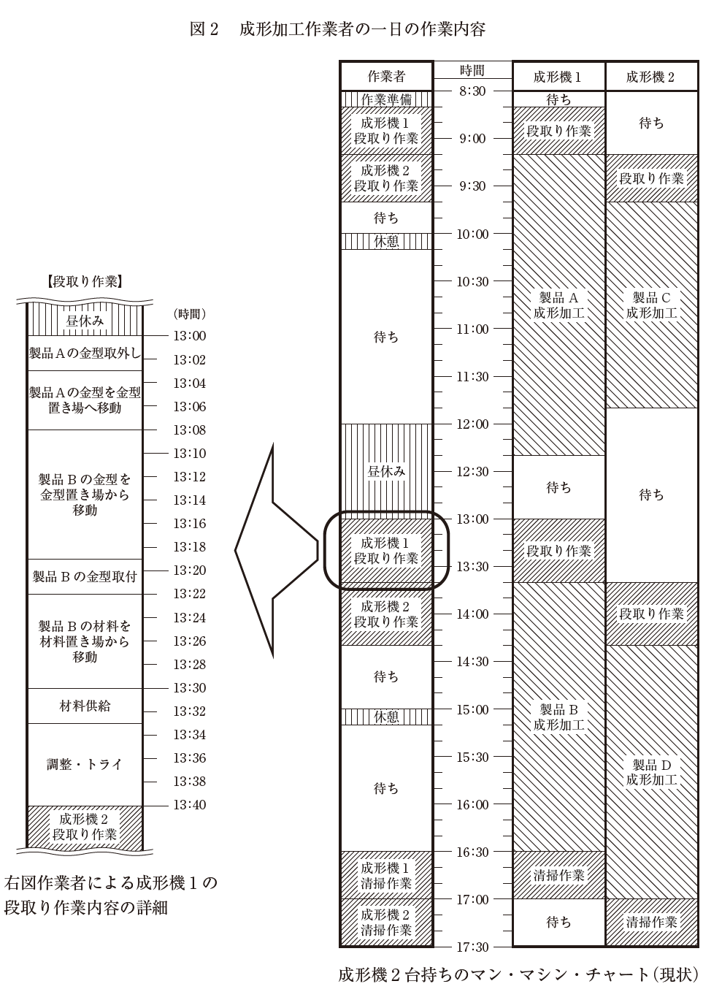
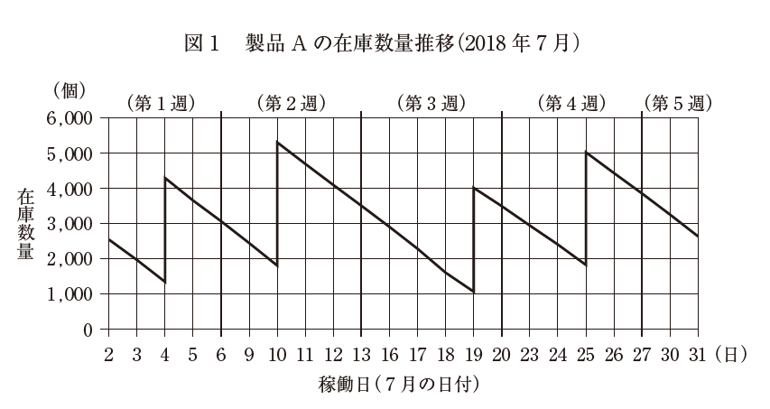

:toc: left
:toclevels: 5
:sectnums:
:stem:
:source-highlighter: coderay

= プラスチック射出成形加工を営むC社の事例

== 与件

【C 社の概要】

　C 社は、1974 年の創業以来、大手電気・電子部品メーカー数社を顧客（以下「顧客企業」という）に、電気・電子部品のプラスチック射出成形加工を営む中小企業である。従業員数60 名、年商約9 億円、会社組織は総務部、製造部で構成されている。

　プラスチック射出成形加工（以下「成形加工」という）とは、プラスチックの材料を加熱溶融し、金型内に加圧注入して、固化させて成形を行う加工方法である。C 社では創業当初、顧客企業から金型の支給を受けて、成形加工を行っていた。

　C 社は、住工混在地域に立地していたが、1980 年、C 社同様の立地環境にあった他の中小企業とともに高度化資金を活用して工業団地に移転した。この工業団地には、現在、金属プレス加工、プラスチック加工、コネクター加工、プリント基板製作などの電気・電子部品に関連する中小企業が多く立地している。

　C 社のプラスチック射出成形加工製品（以下「成形加工品」という）は、顧客企業で電気・電子部品に組み立てられ、その後、家電メーカーに納品されて家電製品の一部になる。主に量産する成形加工品を受注していたが、1990 年代後半から顧客企業の生産工場の海外移転に伴い量産品の国内生産は減少し、主要顧客企業からの受注量の減少が続いた。

　こうした顧客企業の動向に対応した方策として、C 社では金型設計と金型製作部門を新設し、製品図面によって注文を受け、金型の設計・製作から成形加工まで対応できる体制を社内に構築した。また、プラスチック成形や金型製作にかかる技能士などの資格取得者を養成し、さらにOJT によってスキルアップを図るなど加工技術力の強化を推進してきた。このように金型設計・製作部門を持ち、技術力を強化したことによって、材料歩留り向上や成形速度の改善など、顧客企業の成形加工品のコスト低減のノウハウを蓄積することができた。

　C 社が立地する工業団地の中小企業も大手電気・電子部品メーカーを顧客としていたため、C 社同様工業団地に移転後、顧客企業の工場の海外移転に伴い経営難に遭遇した企業が多い。そこで工業団地組合が中心となり、技術交流会の定期開催、共同受注や共同開発の実施などお互いに助け合い、経営難を乗り越えてきた。C 社は、この工業団地組合活動のリーダー的存在であった。

　近年、国内需要分の家電製品の生産が国内に戻る傾向があり、以前の国内生産品が戻りはじめた。それによって、C 社ではどうにか安定した受注量を確保できる状態になったが、顧客企業からの1 回の発注量が以前よりも少なく、受注量全体としては以前と同じレベルまでには戻っていない。

　最近C 社は、成形加工の際に金属部品などを組み込んでしまう成形技術（インサート成形）を習得し、古くから取引のある顧客企業の1 社からの受注に成功している。それまで他社の金属加工品とC 社の成形加工品、そして顧客企業での両部品の組立という3 社で分担していた工程が、C 社の高度な成形技術によって金属加工品をC社の成形加工で組み込んで納品するため、顧客企業の工程数の短縮や納期の短縮、そしてコスト削減も図られることになる。

【生産概要】

　製造部は、生産管理課、金型製作課、成形加工課、品質管理課で構成されている。生産管理課は顧客企業との窓口になり生産計画の立案、資材購買管理、製品在庫管理を、金型製作課は金型設計・製作を、成形加工課は成形加工を、品質管理課は製品検査および品質保証をそれぞれ担当している。

　主要な顧客企業の成形加工品は、繰り返し発注され、毎日指定の数量を納品する。C 社の受注量の半数を占める顧客企業X 社からの発注については、毎週末の金曜日に翌週の月曜日から金曜日の確定納品計画が指示される。C 社の生産管理課ではX社の確定納品計画に基づき、それにその他の顧客企業の受注分を加え、毎週金曜日に翌週の生産計画を確定する。日々の各製品の成形加工は、各設備の能力、稼働状況を考慮して原則週１ 回計画される。また、生産ロットサイズは長時間を要するプラスチック射出成形機（以下「成形機」という）の段取り時間を考慮して決定される。生産効率を上げるために生産ロットサイズは受注量よりも大きく計画され、製品在庫が過大である。C 社の主要製品で、最も生産数量が多いX 社製品A の今年7 月2 日（月）から7 月31 日（火）までの在庫数量推移を図1 に示す。製品A は、毎日600 個前後の納品指定数であり、C 社の生産ロットサイズは約3,000 個で週1 回の生産を行っている。他の製品は、毎日の指定納品数量が少なく、変動することもあるため、製品A以上に在庫管理に苦慮している。

　成形加工課の作業は、作業者1 人が2 台の成形機を担当し、段取り作業、成形機のメンテナンスなどを担当している。また全ての成形機は、作業者が金型をセットし材料供給してスタートを指示すれば、製品の取り出しも含め自動運転し、指示した成形加工を終了すると自動停止状態となる。

　図2 で示す「成形機2 台持ちのマン・マシン・チャート（現状）」は、製品A の成形加工を担当している1 人の作業者の作業内容である。成形機の段取り時間が長時間となっている主な原因は、金型、使用材料などを各置き場で探し、移動し、準備する作業に長時間要していることにある。図2 で示す「成形機1 の段取り作業内容の詳細」は、製品A の成形加工作業者が、昼休み直後に行った製品B のための段取り作業の内容である。金型は顧客からの支給品もまだあり、C社内で統一した識別コードがなく、また置き場も混乱していることから、成形加工課の中でもベテラン作業者しか探すことができない金型まである。また使用材料は、仕入先から材料倉庫に納品されるが、その都度納品位置が変わり探すことになる。顧客企業からは、短納期化、小ロット化、多品種少量化がますます要望される状況にあり、ジャストインタイムな生産に移行するため、C 社では段取り作業時間の短縮などの改善によってそれに対応することを会社方針としている。

　その対策の一つとして、現在、生産管理のコンピュータ化を進めようとしているが、生産現場で効率的に運用するためには、成形加工課の作業者が効率よく金型、材料などを使用できるようにする必要があり、そのためにデータベース化などの社内準備を検討中である。

（平成30年度　中小企業診断士2次筆記試験　事例3　問題より引用）

== 環境分析

=== 組織図

[plantuml]
----
@startwbs

* C社
** 製造部
*** 生産管理課
*** 金型製作課
*** 成形加工課
*** 品質管理課
** 総務部

@endwbs
----

=== ビジネスモデル

[plantuml]
----
@startmindmap

* ビジネスモデル
** 内部環境
*** 顧客
**** 顧客セグメント
***** 大手電気・電子部品メーカー
***** 家電製品の国内需要者
***** 中堅メーカー・新興企業
***** 将来的な海外顧客
**** 顧客関係
***** 受注生産（カスタマイズ対応）
*****[#lightgreen] 金型設計から製品提供までのワンストップサービス
***** 長期的なパートナーシップ
*** 価値
**** 価値提案
***** コスト削減（材料歩留りの向上、成形速度の改善）
*****[#lightgreen] 付加価値（インサート成形など高い加工技術による工程短縮）
***** 環境対応技術の活用（カーボンニュートラル施策）
**** チャネル
***** 工業団地の技術交流や提携による共同受注
***** DX導入による製造プロセスの自動化
***** 顧客との直接取引
*** インフラ
**** 主要活動
***** プラスチック射出成形加工
*****[#orange] 金型設計・製作
******[#yellow] 生産管理のコンピュータ化
******[#yellow] 製品在庫が過大である
******[#yellow] 成形機の段取り時間が長時間
*****[#lightgreen] 高度な加工技術の開発（例：インサート成形）
***** 環境配慮型技術の研究
**** 主要リソース
*****[#lightgreen] 技術者（資格取得者・技能士）
***** 設備（射出成形機、金型製作装置など）
***** 工場（工業団地内）
**** 主要パートナー
***** 工業団地内の中小企業
***** 顧客企業（電気・電子メーカー）
***** 技術開発を支援する研究機関・大学
*** 資金
**** 収益源
***** 顧客からの受注による収益
***** 技術提案による高付加価値製品の受注
***** サービス展開（メンテナンス契約等）
**** コスト構造
***** 設備維持・更新費
***** 環境規制対応費
***** 人件費（技能士育成、資格取得費含む）
***** 資材費（プラスチック材料、金型材料）
left side
** 外部環境
*** 競争
**** 同業他社（国内外の電気・電子関連加工業者）
**** グローバル競争（特に海外生産での低コスト競争）
**** 独自技術・特許による差異化戦略
**** 物流や規制面での競争要因
*** 政治・社会・技術
****[#lightblue] 国内回帰傾向（生産の国内シフト）
**** 加工技術の進化（高度成形技術）
**** 環境規制（プラスチック使用の制限など）
**** 持続可能な技術への対応（SDGs達成）
*** マクロ経済
**** 顧客企業の需要変動（経済情勢の影響）
**** 為替動向による輸出入コストの影響
**** 地政学リスクの影響
*** 市場
****[#lightblue] 家電市場の回復傾向
**** 電気・電子部品の高付加価値市場
**** 新規参入分野（自動車部品、医療機器）

@endmindmap
----

=== SWOT分析

[plantuml]
----
@startmindmap

* SWOT
** 内部環境
***[#lightgreen] 強み
**** 高度な加工技術（インサート成形、金型設計・製作への対応）
**** 技術者の育成（資格取得者と技能士による高い技術力）
**** 工業団地のリーダー的存在（地域協力と共同開発体制）
**** コスト削減ノウハウ（材料歩留り改善、成形速度向上）
**** 環境規制対応技術と持続可能な製品提案
***[#yellow] 弱み
**** 主要顧客への依存度が高い
**** 一部受注量が減少している（海外生産シフトの影響）
**** 設備投資や技術開発がコスト負担増につながる可能性
**** 受注量の減少に伴う全体売上の不安定性
**** 生産設備の一部で段取り時間が長い問題が発生中
left side
** 外部環境
***[#lightblue] 機会
**** 国内生産回帰傾向（家電市場の国内シフト）
**** 技術的な付加価値への需要増（インサート成形技術など）
**** 工業団地内での共同受注や技術交流の活用
**** 環境対策・規制に対応したプラスチック加工への需要
**** 持続可能性を求める企業需要の増加（SDGs達成への貢献）
***[#red] 脅威
**** グローバルでの価格競争（海外生産企業とのコスト差）
**** 顧客企業のさらなる海外移転
**** 環境規制が素材や生産手法に与える影響
**** 新規参入企業や同業他社による競争激化
**** 経済情勢による需要の変動（リセッションなどのリスク）

@endmindmap
----

=== VRIO分析

[plantuml]
----
@startmindmap

* VRIO
** 経済的価値
*** 高度なプラスチック射出成形技術（材料歩留り向上、成形速度改善によるコスト削減）
*** インサート成形技術による工程短縮と顧客のコスト削減
*** 金型設計から成形加工までのワンストップ対応での価値提供
*** 環境規制対応型技術の活用（持続可能性を提供）
** 希少性
*** インサート成形の高水準技術
*** 技能士資格取得者の割合が高く、技術力のある人材
*** 工業団地内でのリーダー的存在（共同開発・技術交流実績）
*** 特許化・技術転用が難しい専門的な知識の保有
left side
** 模倣困難性
*** 技術力の積み重ね（材料効率化、成形速度のノウハウ）
*** 長年の顧客企業との信頼関係
*** 技術者育成体制（OJTと資格取得支援の組み合わせ）
*** 工業団地内で築いた地域連携のネットワーク
*** 独自開発した成形技術（特に環境対応技術）は低模倣性
** 組織能力
*** 部門構成（生産管理、金型製作、成形加工、品質管理など）の効率的運営
*** 技術者のスキルアップの継続的支援体制
*** 顧客企業のニーズを的確に捉えた柔軟な生産体制
*** 持続可能性を考慮した製造工程への適応力

@endmindmap
----

== 事業分析

=== 企業戦略

==== ドメイン

[plantuml]
----
@startmindmap

* ドメイン
** 企業ドメイン
*** 理念
**** 高品質な製品を通じて顧客と社会に貢献する
**** 持続可能な社会を目指し、環境に配慮した技術の開発を追求する
*** ビジョン
**** 技術革新と顧客志向の柔軟な生産で、業界トップレベルの信頼を獲得する
**** 環境規制に適応しつつ世界に通用する技術を提供する
*** ミッション
**** 顧客の期待を超える加工技術を提供し、持続可能な成長を実現する
**** 地域社会と連携し、次世代の技術者育成に取り組む
** 事業ドメイン
*** 誰に
**** 大手電気・電子部品メーカーを中心とした高精密部品を必要とする企業
**** 新興メーカーや環境配慮型製品を求める企業
*** 何を
**** プラスチック射出成形製品、インサート成形製品、金型設計・製作サービス
**** 環境対応技術を活用した持続可能な製品
***[#orange] どのように
**** 高度な加工技術、高精度の金型設計、人材育成と設備投資による生産効率の最大化
**** 環境負荷を低減する技術や材料の導入

@endmindmap
----

==== 成長戦略

[plantuml]
----
@startmindmap

* 成長戦略
** 既存市場
***[#orange] 市場浸透
**** 既存顧客との信頼関係をさらに強化
**** 高品質・安定供給で取引シェアを拡大
**** 工業団地内の共同受注を増加
**** 持続可能性を重視した付加価値サービスの提供
*** 商品開発
**** 新規製品（例：より複雑なインサート成形部品）の開発
**** 環境対応型材料を使用した製品ライン強化
**** 顧客にカスタマイズ可能な製品の提案
**** IoTを活用した製品の開発（DX推進に向けた技術応用）
** 新市場
*** 市場開発
**** 国内未開拓地域への販売展開
**** 海外市場での製品提供（特に東南アジアやアフリカ市場）
**** 環境規制対応の技術を活用した新規市場開拓
**** 環境配慮型製品を重視する国や地域への重点展開（例：EU市場）
*** 多角化
**** 水平的多角化
***** プラスチック射出成形技術を応用した新分野（例：医療機器、精密機器）
***** 環境関連分野（例：再生可能エネルギー機器や部品）
**** 垂直型多角化
***** 原材料供給チェーンへの参入
***** 流通や販売業務への統合
***** 廃プラスチックリサイクル事業への参入
**** 集中型多角化
***** 既存技術を応用して関連事業（エレクトロニクス部品）へ展開
***** 金型設計の技術を応用して他分野（自動車や航空宇宙）への展開
**** 集成型多角化
***** 工業団地内企業との提携を活用し新製品ラインの開発
***** 地域社会との連携強化による製品やサービスの共同開発

@endmindmap
----

==== イシューツリー

[plantuml]
----
@startmindmap

* イシューツリー
left side
** ドメイン
*** 企業ドメイン
**** 理念
***** 高品質な製品を通じて顧客と社会に貢献する
***** 持続可能な社会を目指し、環境に配慮した技術の開発を追求する
**** ビジョン
***** 技術革新と顧客志向の柔軟な生産で、業界トップレベルの信頼を獲得する
***** 環境規制に適応しつつ世界に通用する技術を提供する
**** ミッション
***** 顧客の期待を超える加工技術を提供し、持続可能な成長を実現する
***** 地域社会と連携し、次世代の技術者育成に取り組む
*** 事業ドメイン
**** 誰に
***** 大手電気・電子部品メーカーを中心とした高精密部品を必要とする企業
***** 新興メーカーや環境配慮型製品を求める企業
**** 何を
***** プラスチック射出成形製品、インサート成形製品、金型設計・製作サービス
***** 環境対応技術を活用した持続可能な製品
****[#orange] どのように
***** 高度な加工技術、高精度の金型設計、人材育成と設備投資による生産効率の最大化
***** 環境負荷を低減する技術や材料の導入
right side
** 成長戦略
*** 既存市場
****[#orange] 市場浸透
***** 既存顧客との信頼関係をさらに強化
***** 高品質・安定供給で取引シェアを拡大
***** 工業団地内の共同受注を増加
***** 持続可能性を重視した付加価値サービスの提供
**** 商品開発
***** 新規製品（例：より複雑なインサート成形部品）の開発
***** 環境対応型材料を使用した製品ライン強化
***** 顧客にカスタマイズ可能な製品の提案
***** IoTを活用した製品の開発（DX推進に向けた技術応用）
*** 新市場
**** 市場開発
***** 国内未開拓地域への販売展開
***** 海外市場での製品提供（特に東南アジアやアフリカ市場）
***** 環境規制対応の技術を活用した新規市場開拓
***** 環境配慮型製品を重視する国や地域への重点展開（例：EU市場）
**** 多角化
***** 水平的多角化
****** プラスチック射出成形技術を応用した新分野（例：医療機器、精密機器）
****** 環境関連分野（例：再生可能エネルギー機器や部品）
***** 垂直型多角化
****** 原材料供給チェーンへの参入
****** 流通や販売業務への統合
****** 廃プラスチックリサイクル事業への参入
***** 集中型多角化
****** 既存技術を応用して関連事業（エレクトロニクス部品）へ展開
****** 金型設計の技術を応用して他分野（自動車や航空宇宙）への展開
***** 集成型多角化
****** 工業団地内企業との提携を活用し新製品ラインの開発
****** 地域社会との連携強化による製品やサービスの共同開発

@endmindmap
----

=== 事業戦略

==== 基本戦略

[plantuml]
----
@startmindmap

* 基本戦略
** コストリーダーシップ
*** 材料歩留りの向上や成形速度の改善により生産コストを削減
*** 工業団地での共同調達・効率化によるコスト圧縮
*** 高度な設備運用で長期的な維持コストの低下を実現
*** 工程の自動化やDX（デジタルトランスフォーメーション）推進により生産効率を向上
**[#orange] 差別化
*** 高精度なインサート成形技術の提供
*** 金型設計から製品供給までのワンストップサービス
*** 技術者による専門的なカスタマイズ対応
*** 環境規制対応型製品の開発で新しい市場ニーズに応える
*** 持続可能素材の採用と環境配慮デザインで差別化
*** IoTやAIを活用した次世代型製品の提供
** 集中
*** 電気・電子部品メーカーを中心とした特定顧客への特化
*** 工業団地内での企業連携を活用して地域密着型戦略を推進
*** 高技術を求める限定された市場（精密部品、医療機器など）での競争優位性確立
*** 環境関連市場（リサイクル材使用製品やグリーンエネルギー部品分野）への集中展開

@endmindmap
----

==== 競争戦略

[plantuml]
----
@startmindmap

* 競争戦略
** リーダー
*** 市場拡大
**** 工業団地内企業との共同開発で市場規模の拡大を目指す
**** 環境規制対応型の新製品開発を通じて新市場を取り込む
**** 顧客に提案型の営業を強化し、シェアを拡大
**** デジタルトランスフォーメーション（DX）推進による市場・顧客対応力強化
*** 同質化
**** 大手同業他社と同等の品質基準を維持しつつ迅速な生産対応を実施
**** 同業他社の技術に追随しない独自性を保ちながらも顧客に安心感を提供
**** 継続的な品質改善プログラムを展開し、一貫した信頼性を確立
** チャレンジャー
***[#orange] 差別化
**** 他社との差別化を図る高精度インサート成形技術の提供
**** 金型設計・作成から製品提供までの一貫体制による付加価値創出
**** 環境配慮型素材の活用とサステナビリティを重視した生産
**** AI・IoT技術を使用して生産効率を向上させたスマート製品の提供
** ニッチャー
***[#orange] 集中
**** 特定の高精度部品市場（医療機器や電子部品など）にリソースを集中
**** 地域の工業団地内での限定的市場における高い存在感を発揮
**** 他社では対応困難な高度カスタマイズ製品を重点的に取り扱う
**** 特定業界の特殊ニーズに対応した製品（例：環境関連機器）の提供
** フォロワー
*** 追随
**** 既存市場での他社トレンド分析を活かし、適応した製品開発を実施
**** 大手顧客の技術要求に合わせた柔軟な対応で関係維持を強化
**** 成形速度改善や材料管理技術で他社優位性の取り込み
**** 市場の変化に迅速に適応し、既存製品の競争力を高める

@endmindmap
----

==== 価値連鎖

[plantuml]
----
@startmindmap

* 価値連鎖
** 主活動
*** 購買物流
**** 原材料の効率的調達（地元工業団地との連携を活用）
**** 在庫管理とコスト低減のためのデジタルツール導入
**** 安定供給のための複数仕入れルートの確保
**** 環境負荷を考慮した調達方針の導入
***[#orange] 製造
**** 高精度を実現する射出成形技術とインサート成形技術
**** 熟練技術者による品質管理
**** 工程の自動化と省エネルギー化の促進
**** スマートファクトリーシステムの導入で生産性向上
*** 出荷物流
**** 短納期実現のための効率化された物流ネットワーク
**** 顧客ごとにカスタマイズされた梱包サービス
**** リアルタイム出荷状況の追跡システム導入
**** 環境配慮型物流（例：エコ配送オプション）の導入
*** マーケティング・販売
**** 技術提案型営業活動による顧客ニーズの的確な把握
**** 展示会などでの技術PRや製品プレゼンテーション
**** 小規模顧客向けに柔軟な対応を行うコミュニケーション強化
**** デジタルマーケティングの活用による新規顧客との接触機会拡大
*** サービス
**** 製品納品後のアフターサービス（不具合対応、メンテナンス提案）
**** 顧客工場での技術指導やトラブルシューティング支援
**** 継続的なフィードバックの収集と改善
**** リモートサポート技術の導入で迅速な対応を実現
** 支援活動
***[#orange] インフラストラクチャ
**** ISO認証や品質マネジメントシステムを活用した全社的運営
**** 生産管理ソフトの導入による効率化
**** 工場レイアウトの最適化で設備稼働率を向上
**** サステナビリティを考慮した工場運営方針を策定
***[#orange] 人事・労務管理
**** OJTと資格取得支援を組み合わせた技術者育成プログラム
**** 働きやすさを重視した柔軟な勤務体制の構築
**** 社内コミュニケーションとモチベーション向上施策の実施
**** ダイバーシティ推進プログラムの実行
*** 技術開発
**** 射出成形機能における技術力向上と特許の獲得
**** 新素材の研究開発と市場投入
**** 顧客要望に応じたカスタム製品の技術試作
**** 環境対応技術（例：リサイクル素材の使用）の開発
*** 調達活動
**** 材料サプライヤーとの長期的関係構築
**** 原材料コスト削減と品質向上を両立する調達方針
**** 代替材料の調達体制を確立しリスクを軽減
**** 持続可能な調達指標を設定しグローバル基準への対応

@endmindmap
----

==== イシューツリー

[plantuml]
----
@startmindmap

* イシューツリー
left side
** 基本戦略
*** コストリーダーシップ
**** 材料歩留りの向上や成形速度の改善により生産コストを削減
**** 工業団地での共同調達・効率化によるコスト圧縮
**** 高度な設備運用で長期的な維持コストの低下を実現
**** 工程の自動化やDX（デジタルトランスフォーメーション）推進により生産効率を向上
***[#orange] 差別化
**** 高精度なインサート成形技術の提供
**** 金型設計から製品供給までのワンストップサービス
**** 技術者による専門的なカスタマイズ対応
**** 環境規制対応型製品の開発で新しい市場ニーズに応える
**** 持続可能素材の採用と環境配慮デザインで差別化
**** IoTやAIを活用した次世代型製品の提供
*** 集中
**** 電気・電子部品メーカーを中心とした特定顧客への特化
**** 工業団地内での企業連携を活用して地域密着型戦略を推進
**** 高技術を求める限定された市場（精密部品、医療機器など）での競争優位性確立
**** 環境関連市場（リサイクル材使用製品やグリーンエネルギー部品分野）への集中展開
** 競争戦略
*** リーダー
**** 市場拡大
***** 工業団地内企業との共同開発で市場規模の拡大を目指す
***** 環境規制対応型の新製品開発を通じて新市場を取り込む
***** 顧客に提案型の営業を強化し、シェアを拡大
***** デジタルトランスフォーメーション（DX）推進による市場・顧客対応力強化
**** 同質化
***** 大手同業他社と同等の品質基準を維持しつつ迅速な生産対応を実施
***** 同業他社の技術に追随しない独自性を保ちながらも顧客に安心感を提供
***** 継続的な品質改善プログラムを展開し、一貫した信頼性を確立
*** チャレンジャー
****[#orange] 差別化
***** 他社との差別化を図る高精度インサート成形技術の提供
***** 金型設計・作成から製品提供までの一貫体制による付加価値創出
***** 環境配慮型素材の活用とサステナビリティを重視した生産
***** AI・IoT技術を使用して生産効率を向上させたスマート製品の提供
*** ニッチャー
****[#orange] 集中
***** 特定の高精度部品市場（医療機器や電子部品など）にリソースを集中
***** 地域の工業団地内での限定的市場における高い存在感を発揮
***** 他社では対応困難な高度カスタマイズ製品を重点的に取り扱う
***** 特定業界の特殊ニーズに対応した製品（例：環境関連機器）の提供
*** フォロワー
**** 追随
***** 既存市場での他社トレンド分析を活かし、適応した製品開発を実施
***** 大手顧客の技術要求に合わせた柔軟な対応で関係維持を強化
***** 成形速度改善や材料管理技術で他社優位性の取り込み
***** 市場の変化に迅速に適応し、既存製品の競争力を高める
right side
** 価値連鎖
*** 主活動
**** 購買物流
***** 原材料の効率的調達（地元工業団地との連携を活用）
***** 在庫管理とコスト低減のためのデジタルツール導入
***** 安定供給のための複数仕入れルートの確保
***** 環境負荷を考慮した調達方針の導入
****[#orange] 製造
***** 高精度を実現する射出成形技術とインサート成形技術
***** 熟練技術者による品質管理
***** 工程の自動化と省エネルギー化の促進
***** スマートファクトリーシステムの導入で生産性向上
**** 出荷物流
***** 短納期実現のための効率化された物流ネットワーク
***** 顧客ごとにカスタマイズされた梱包サービス
***** リアルタイム出荷状況の追跡システム導入
***** 環境配慮型物流（例：エコ配送オプション）の導入
**** マーケティング・販売
***** 技術提案型営業活動による顧客ニーズの的確な把握
***** 展示会などでの技術PRや製品プレゼンテーション
***** 小規模顧客向けに柔軟な対応を行うコミュニケーション強化
***** デジタルマーケティングの活用による新規顧客との接触機会拡大
**** サービス
***** 製品納品後のアフターサービス（不具合対応、メンテナンス提案）
***** 顧客工場での技術指導やトラブルシューティング支援
***** 継続的なフィードバックの収集と改善
***** リモートサポート技術の導入で迅速な対応を実現
*** 支援活動
****[#orange] インフラストラクチャ
***** ISO認証や品質マネジメントシステムを活用した全社的運営
***** 生産管理ソフトの導入による効率化
***** 工場レイアウトの最適化で設備稼働率を向上
***** サステナビリティを考慮した工場運営方針を策定
****[#orange] 人事・労務管理
***** OJTと資格取得支援を組み合わせた技術者育成プログラム
***** 働きやすさを重視した柔軟な勤務体制の構築
***** 社内コミュニケーションとモチベーション向上施策の実施
***** ダイバーシティ推進プログラムの実行
**** 技術開発
***** 射出成形機能における技術力向上と特許の獲得
***** 新素材の研究開発と市場投入
***** 顧客要望に応じたカスタム製品の技術試作
***** 環境対応技術（例：リサイクル素材の使用）の開発
**** 調達活動
***** 材料サプライヤーとの長期的関係構築
***** 原材料コスト削減と品質向上を両立する調達方針
***** 代替材料の調達体制を確立しリスクを軽減
***** 持続可能な調達指標を設定しグローバル基準への対応

@endmindmap
----

=== 機能戦略

==== バリューストリーム

[plantuml]
----
@startmindmap

* バリューストリーム
left side
** 主活動
*** マーケティング
**** 技術提案型営業を活かしたターゲット市場拡大
**** 展示会やデジタルチャネルを通じた認知拡大
**** 顧客分析ツールを活用した新製品開発の方向性確立
*** 購買
**** サプライチェーンの最適化と原材料の安定供給確保
**** 信頼できる取引先からの調達ルールの徹底
**** 環境配慮型調達ポリシーの実施
***[#orange] 製造
**** 高度な射出成形技術による効率的な製品生産
**** 環境配慮型の製造プロセスの採用
**** 工程管理自動化システムの導入と運用
*** 販売
**** クライアントごとのニーズに沿ったカスタムソリューション提供
**** 顧客関係維持を重視したフォローアップ販売活動
**** オンラインと店舗との連携を強化し利便性向上
***[#orange] 出荷
**** ロジスティクス効率化のための出荷自動追跡ソリューション導入
**** グローバルサプライ基盤の整備
**** 最終消費者までの発送コスト効率化プロジェクト
**** 在庫管理の最適化とリードタイム短縮
*** サービス
**** アフターサービス計画の充実
**** 顧客からの定期フィードバックの実施と改善
**** リモートサポートとオンサイトサービスの柔軟な対応
** 支援活動
*** 技術開発
**** 新素材の研究と商品の技術競争力向上
**** 顧客要求に応じた技術プロトタイプ投入
**** 環境対応技術の開発（例：リサイクル可能な素材の使用）
***[#orange] 人事
**** 技術者向けキャリアパス策定
**** 多様な人材育成プログラムの運用
**** フレキシブルな勤務体制と福利厚生整備
*** 会計
**** 製造コスト管理の徹底化による利益率向上
**** 財務データを基にした投資シミュレーションの強化
**** 為替リスクや支出ポートフォリオ管理
***[#orange] インフラストラクチャ
**** デジタルトランスフォーメーションによる業務効率化
**** 全社的な生産性向上プラットフォームの導入
**** ITセキュリティ強化によるデータ流出防止
right side
** 戦略
*** マーケティング
**** 製品：顧客ニーズを反映した製品ラインアップ展開
**** 価格：競争市場における最適価格設定
**** チャネル：オンラインとオフラインの販売チャネル統合
**** プロモーション：技術特化型セミナーを通じた認知向上
**** ブランド強化とESGに基づく価値訴求
*** 市場調査
**** トレンド分析と競合調査による市場ポジショニングの戦略設計
**** 顧客行動データから新規市場セグメント特定
*** 販売計画
**** 短期・中期スケジュールに基づいた販売活動
**** 前年度データを活用した地域別販売計画
**[#orange] 生産管理
*** 生産計画
**** 需要予測を活用した正確な生産量管理
**** 整流生産方式の積極的な活用
*** MRP
**** 材料要件計画ソフトの運用で資材管理を最適化
**** 需要変動に応じた柔軟な資材調整プロセス
*** 工程管理
**** 生産工程の可視化で効率を向上
**** 省エネルギー型設備を採用した運用
*** 製造管理
**** リアルタイムでの進捗追跡と不良品削減の仕組み
**** 全自動の品質管理機能の強化
** 販売管理
*** 受注管理
**** 短納期対応を可能にする効率的な受注プロセス
**** EDIシステムを活用した受発注プロセスの簡素化
*** 出荷管理
**** 日次・週次報告の実施で確実な出荷をサポート
**** リードタイム短縮のための外部委託の最適化
*** 売上管理
**** 顧客データに基づく属人的影響を排除した売上管理システム
**** 収益性分析を基にした短期的価格修正の導入
**[#orange] 在庫管理
*** 在庫管理
**** 過剰在庫リスクの低減と適正在庫の維持
*** 受払管理
**** 入出庫状況をリアルタイム管理
*** 棚卸管理
**** 生産スケジュールと整合した棚卸タイミングの最適化
**** 棚卸自動化技術の導入
** 調達管理
*** 発注管理
**** 正確な発注タイミングの分析と自動化
**** KPIを活用した発注精度の定量評価
*** 入荷管理
**** 入荷プロセスのシステム化によるミス低減
**** シームレスな連携で倉庫保管フローを最適化
*** 仕入管理
**** コスト削減を目指した仕入れ戦略
**** 米ドルやユーロ市場変動への適応策
** 人事管理
*** 給与計算
**** 生産性に応じたインセンティブ制度の導入
*** 人的資源管理
**** 雇用管理：安定雇用につながる長期的視野の採用戦略
**** 能力開発：職能強化型研修と資格支援プログラム
**** 報酬管理：公平な評価スキームの実施
**** 評価制度：目標管理と成果を重視した評価システム
**** 働きがい向上策の具体的な実施

@endmindmap
----

==== ケイパビリティマッピング

[plantuml]
----
@startmindmap

* ビジネスケイパビリティマップ
** コア
*** 戦略
**** マーケティング
***** 製品：顧客ニーズに応じた製品設計と幅広い製品ライン展開
***** 価格：市場データ分析に基づく価格競争力のある設定
***** チャネル：オンラインとオフラインを融合した統合的販売チャネル
***** プロモーション：技術系展示会や業界特化型広告による知名度向上
**** 市場調査
***** 顧客データとトレンド分析を用いた将来的な市場予測
***** 競合調査によるニッチ市場の特定
**** 販売計画
***** 短中長期的な販売ターゲットとスケジュール管理
***** 地域別および顧客セグメント別の販売施策
*** 生産管理
**** 生産計画
***** 顧客需要に基づいた柔軟な計画・調整
**** MRP
***** 資材の不足回避と効率的発注を実現する要件計画
***** サプライチェーンデータ統合によるリアルタイム監視
**** 工程管理
***** 高品質基準を満たす実際の生産工程の監視と統制
***** ボトルネックの早期発見と解決による運用改善
**** 製造管理
***** 作業効率と不良率低減を目指した全体最適化
***** 工場内IoT導入によるリアルタイム管理
*** 人事管理
**** 人的資源管理
***** 雇用管理：多様性を考慮したスキルベースの雇用方針
***** 能力開発：技術研修や資格取得支援によるスキル向上
***** 報酬管理：成果に基づく給与とインセンティブ制度
***** 評価制度：公平で透明性のある評価基準設定
***** 従業員満足度向上を目指したワークライフバランスの実現

** 汎用
*** 販売管理
**** 受注管理
***** 柔軟性とスピードを備えた受注システム
***** 特急対応を可能にするプロセス整備
**** 出荷管理
***** 予定通りの納品を保証する物流サポート
***** 自動化された配送スケジュールの運用
**** 売上管理
***** リアルタイムデータに基づく売上分析と予測
***** 在庫・販売統合による収益最適化の実現
*** 在庫管理
**** 在庫管理
***** 需要調整と在庫最小化のための統計的手法導入
***** 倉庫自動化プロジェクトの推進
**** 受払管理
***** 正確でトレーサブルな物流記録
**** 棚卸管理
***** 自動化された棚卸プロセス
***** エラー率を削減した在庫確認システム
*** 調達管理
**** 発注管理
***** タイムリーで適正な発注スケジュール
***** ERPシステムの活用による発注プロセス統一
**** 入荷管理
***** 品質検査と効率改善を組み込んだ入荷プロセス
***** 損害ゼロを目指した受け取り体制の整備
**** 仕入管理
***** サプライヤーとの関係管理によるコスト最適化
***** 長期契約による安定調達の確保

** サポート
*** 会計
**** 財務会計
***** 収益管理と財務計画の策定
**** 管理会計
***** 部門収益とコスト評価を実施
**** 債権管理
***** 取引先の与信と債権回収プロセスの効率化
**** 債務管理
***** 支払スケジュール管理でキャッシュフローを最適化
**** 手形管理
***** 受払の正確性とリスク削減のため手形データ管理
***** 電子手形対応による紙ベース運用の削減
**** 経理管理
***** 会社の経理システムのオペレーション向上
***** AIツール導入による手作業負担の軽減
**** 資産管理
***** 社内資産の価値維持と使用状況の追跡
***** 未稼働資産の有効活用プランの策定
**** キャッシュフロー
***** 資金運用の効率化と収支バランス管理
***** 短期および長期的なキャッシュフロー分析
*** 人事管理
**** 給与計算
***** 最新システムで自動化・改善された給与計算プロセス
***** 従業員満足度向上のための柔軟な支払いスキーム

@endmindmap
----

==== 組織マップ
[plantuml]
----
@startmindmap

* C社
** 製造部
*** 生産管理課
**** 生産管理
***** 生産計画
***** MRP
*** 金型製作課
*** 成形加工課
**** 生産管理
***** 工程管理
***** 製造管理
*** 品質管理課
**** 在庫管理
***** 在庫管理
***** 受払管理
***** 棚卸管理
**** 調達管理
***** 発注管理
***** 入荷管理
***** 仕入管理
** 総務部
*** マーケティング
*** 販売計画
*** 販売管理
**** 受注管理
**** 出荷管理
**** 売上管理
*** 会計
*** 人事管理
**** 給与計算
**** 人的資源管理
left side
** コア
*** 戦略
**** マーケティング
***** 製品：顧客ニーズに応じた製品設計と幅広い製品ライン展開
***** 価格：市場データ分析に基づく価格競争力のある設定
***** チャネル：オンラインとオフラインを融合した統合的販売チャネル
***** プロモーション：技術系展示会や業界特化型広告による知名度向上
**** 市場調査
***** 顧客データとトレンド分析を用いた将来的な市場予測
***** 競合調査によるニッチ市場の特定
**** 販売計画
***** 短中長期的な販売ターゲットとスケジュール管理
***** 地域別および顧客セグメント別の販売施策
*** 生産管理
**** 生産計画
***** 顧客需要に基づいた柔軟な計画・調整
**** MRP
***** 資材の不足回避と効率的発注を実現する要件計画
***** サプライチェーンデータ統合によるリアルタイム監視
**** 工程管理
***** 高品質基準を満たす実際の生産工程の監視と統制
***** ボトルネックの早期発見と解決による運用改善
**** 製造管理
***** 作業効率と不良率低減を目指した全体最適化
***** 工場内IoT導入によるリアルタイム管理
*** 人事管理
**** 人的資源管理
***** 雇用管理：多様性を考慮したスキルベースの雇用方針
***** 能力開発：技術研修や資格取得支援によるスキル向上
***** 報酬管理：成果に基づく給与とインセンティブ制度
***** 評価制度：公平で透明性のある評価基準設定
***** 従業員満足度向上を目指したワークライフバランスの実現

** 汎用
*** 販売管理
**** 受注管理
***** 柔軟性とスピードを備えた受注システム
***** 特急対応を可能にするプロセス整備
**** 出荷管理
***** 予定通りの納品を保証する物流サポート
***** 自動化された配送スケジュールの運用
**** 売上管理
***** リアルタイムデータに基づく売上分析と予測
***** 在庫・販売統合による収益最適化の実現
*** 在庫管理
**** 在庫管理
***** 需要調整と在庫最小化のための統計的手法導入
***** 倉庫自動化プロジェクトの推進
**** 受払管理
***** 正確でトレーサブルな物流記録
**** 棚卸管理
***** 自動化された棚卸プロセス
***** エラー率を削減した在庫確認システム
*** 調達管理
**** 発注管理
***** タイムリーで適正な発注スケジュール
***** ERPシステムの活用による発注プロセス統一
**** 入荷管理
***** 品質検査と効率改善を組み込んだ入荷プロセス
***** 損害ゼロを目指した受け取り体制の整備
**** 仕入管理
***** サプライヤーとの関係管理によるコスト最適化
***** 長期契約による安定調達の確保

** サポート
*** 会計
**** 財務会計
***** 収益管理と財務計画の策定
**** 管理会計
***** 部門収益とコスト評価を実施
**** 債権管理
***** 取引先の与信と債権回収プロセスの効率化
**** 債務管理
***** 支払スケジュール管理でキャッシュフローを最適化
**** 手形管理
***** 受払の正確性とリスク削減のため手形データ管理
***** 電子手形対応による紙ベース運用の削減
**** 経理管理
***** 会社の経理システムのオペレーション向上
***** AIツール導入による手作業負担の軽減
**** 資産管理
***** 社内資産の価値維持と使用状況の追跡
***** 未稼働資産の有効活用プランの策定
**** キャッシュフロー
***** 資金運用の効率化と収支バランス管理
***** 短期および長期的なキャッシュフロー分析
*** 人事管理
**** 給与計算
***** 最新システムで自動化・改善された給与計算プロセス
***** 従業員満足度向上のための柔軟な支払いスキーム

@endmindmap
----

==== 情報マップ

==== ビジネスシナリオ

==== イシューツリー

[plantuml]
----
@startmindmap

* イシューツリー
** C社
*** 製造部
**** 生産管理課
***** 生産管理
****** 生産計画
****** MRP
**** 金型製作課
**** 成形加工課
***** 生産管理
****** 工程管理
****** 製造管理
**** 品質管理課
***** 在庫管理
****** 在庫管理
****** 受払管理
****** 棚卸管理
***** 調達管理
****** 発注管理
****** 入荷管理
****** 仕入管理
*** 総務部
**** マーケティング
**** 販売計画
**** 販売管理
***** 受注管理
***** 出荷管理
***** 売上管理
**** 会計
**** 人事管理
***** 給与計算
***** 人的資源管理
left side
** 戦略
*** マーケティング
**** 製品：顧客ニーズを反映した製品ラインアップ展開
**** 価格：競争市場における最適価格設定
**** チャネル：オンラインとオフラインの販売チャネル統合
**** プロモーション：技術特化型セミナーを通じた認知向上
**** ブランド強化とESGに基づく価値訴求
*** 市場調査
**** トレンド分析と競合調査による市場ポジショニングの戦略設計
**** 顧客行動データから新規市場セグメント特定
*** 販売計画
**** 短期・中期スケジュールに基づいた販売活動
**** 前年度データを活用した地域別販売計画
**[#orange] 生産管理
*** 生産計画
**** 需要予測を活用した正確な生産量管理
**** 整流生産方式の積極的な活用
*** MRP
**** 材料要件計画ソフトの運用で資材管理を最適化
**** 需要変動に応じた柔軟な資材調整プロセス
*** 工程管理
**** 生産工程の可視化で効率を向上
**** 省エネルギー型設備を採用した運用
*** 製造管理
**** リアルタイムでの進捗追跡と不良品削減の仕組み
**** 全自動の品質管理機能の強化
** 販売管理
*** 受注管理
**** 短納期対応を可能にする効率的な受注プロセス
**** EDIシステムを活用した受発注プロセスの簡素化
*** 出荷管理
**** 日次・週次報告の実施で確実な出荷をサポート
**** リードタイム短縮のための外部委託の最適化
*** 売上管理
**** 顧客データに基づく属人的影響を排除した売上管理システム
**** 収益性分析を基にした短期的価格修正の導入
**[#orange] 在庫管理
*** 在庫管理
**** 過剰在庫リスクの低減と適正在庫の維持
*** 受払管理
**** 入出庫状況をリアルタイム管理
*** 棚卸管理
**** 生産スケジュールと整合した棚卸タイミングの最適化
**** 棚卸自動化技術の導入
** 調達管理
*** 発注管理
**** 正確な発注タイミングの分析と自動化
**** KPIを活用した発注精度の定量評価
*** 入荷管理
**** 入荷プロセスのシステム化によるミス低減
**** シームレスな連携で倉庫保管フローを最適化
*** 仕入管理
**** コスト削減を目指した仕入れ戦略
**** 米ドルやユーロ市場変動への適応策
** 人事管理
*** 給与計算
**** 生産性に応じたインセンティブ制度の導入
*** 人的資源管理
**** 雇用管理：安定雇用につながる長期的視野の採用戦略
**** 能力開発：職能強化型研修と資格支援プログラム
**** 報酬管理：公平な評価スキームの実施
**** 評価制度：目標管理と成果を重視した評価システム
**** 働きがい向上策の具体的な実施

@endmindmap
----

== 業務分析

[plantuml]
----
@startmindmap

* ドメイン

left side
** 企業ドメイン
*** 理念
*** ビジョン
*** ミッション
** 事業ドメイン
*** 誰に
*** 何を
*** どのように

right side

** サブドメイン
*** コアサブドメイン
*** 汎用サブドメイン
*** サポートサブドメイン

@endmindmap
----

=== 業務領域(サブドメイン)

==== 中核の業務領域(コアサブドメイン)

==== 一般的な業務領域(汎用サブドメイン)

==== 補完的な業務領域(サポートサブドメイン)

=== ビジネスコンテキスト

=== ビジネスユースケース

==== 業務

===== ユースケース図

[plantuml]
----
@startuml

title ビジネスユースケース

@enduml
----

==== シーケンス図

[plantuml]
----
@startuml

title 業務シーケンス図

@enduml
----

==== 業務フロー図

===== 業務

[plantuml]
----
@startuml

title 業務フロー

@enduml
----

