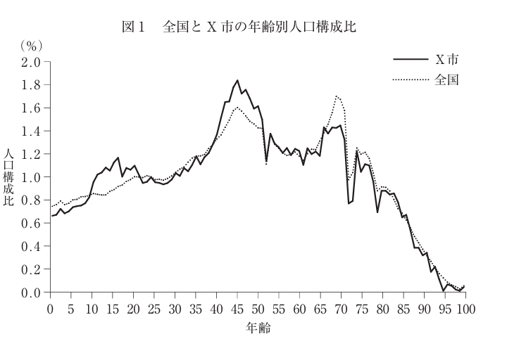
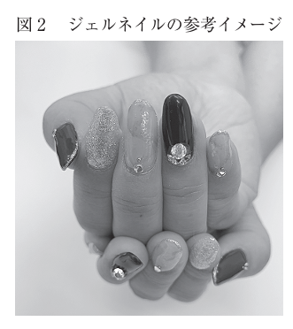
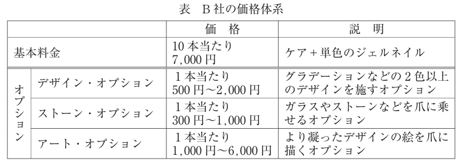

:toc: left
:toclevels: 5
:sectnums:
:stem:
:source-highlighter: coderay

= ネイルサロンB社の事例

== 与件

　B社は資本金200万円、社長を含む従業者2名の完全予約制ネイルサロンであり、地方都市X市内の商店街に立地する。この商店街は県内では大規模であり、週末には他地域からも来街客がある。中心部には小型百貨店が立地し、その周辺には少数ではあるが有名ブランドの衣料品店、宝飾店などのファッション関連の路面店が出店している。中心部以外には周辺住民が普段使いするような飲食店や生鮮品店、食料品店、雑貨店、美容室などが出店している。X市は県内でも有数の住宅地であり、中でも商店街周辺は高級住宅地として知られる。X市では商店街周辺を中核として15年前にファミリー向け宅地の開発が行われ、その頃に多数の家族が入居した（現在の人口分布は4ページの図1参照）。当該地域は新興住宅地であるものの、桜祭り、七夕祭り、秋祭り、クリスマス・マーケットなどの町内会、寺社、商店街主催のイベントが毎月あり、行事が盛んな土地柄である。

　B社は2017年に現在の社長が創業した。社長と社員Yさんは共に40 代の女性で、美術大学の同級生であり、美大時代に意気投合した友人でもある。社長は美大卒業後、当該県内の食品メーカーに勤務し、社内各部署からの要望に応じて、パッケージ、販促物をデザインする仕事に従事した。特に在職中から季節感の表現に定評があり、社長が提案した季節限定商品のパッケージや季節催事用のPOPは、同社退職後も継続して利用されていた。Yさんは美大卒業後、X市内2店を含む10店舗を有する貸衣装チェーン店に勤務し、衣装やアクセサリーの組み合わせを提案するコーディネーターとして従事した。2人は同時期の出産を契機に退職し、しばらくは専業主婦として過ごしていた。やがて、子供が手から離れた頃に社長が、好きなデザインの仕事を、家事をこなしながら少ない元手で始められる仕事がないかと思案した結果、ネイルサロンの開業という結論に至った。Yさんも社長の誘いを受け、起業に参加した。なお、Yさんはその時期、前職の貸衣装チェーン店が予約会（注）を開催し、人手が不足する時期に、パートタイマーの同社店舗スタッフとして働いていた。Yさんは七五三、卒業式、結婚式に列席する30～50代の女性顧客に、顧客の要望を聞きながら、参加イベントの雰囲気に合わせて衣装の提案を行う接客が高く評価されており、同社に惜しまれながらの退職であった。2人は開業前にネイリスト専門学校に通い始めた。当初は絵画との筆遣いの違いに戸惑いを覚えたが、要領を得てからは持ち前の絵心で技術は飛躍的に向上した。

　技術を身に付けた2人は、出店候補地の検討を開始した。その過程で空き店舗が見つかり、スペースを改装して、営業を開始した。なお、当該店舗は商店街の中心部からは離れた場所にあり、建築から年数がたっており、細長いスペースが敬遠されていた。そのため、商店街の中では格安の賃貸料で借りることができた。また、デザインや装飾は2人の得意とするところであり、大規模な工事を除く内装のほとんどは手作業で行った。2人が施術すれば満員となるような狭いスペースではあるものの、顧客からは落ち着く雰囲気だと高い評価を得ている。また、Yさんが商店街の貸衣装チェーン店で勤務していた経緯もあり、商店街の他店ともスムーズに良好な関係を構築することができた。

　ネイルサロンとは、ネイル化粧品を用いて手および足の爪にネイルケア、ネイルアートなどを施すサービスを行う店舗を指す。一般にネイルサロンの主力サービスは、ジェルネイルである（ 4ページの図2参照）。ジェルネイルでは、ジェルと呼ばれる粘液状の合成樹脂を爪に塗り、LEDライトもしくはUV（紫外線）ライトを数十秒から1分程度照射してジェルを固める。この爪にジェルを塗る作業と照射を繰り返し、ネイルを完成させる。おおむね両手で平均1時間半の時間を要する（リムーブもしくはオフと呼ばれるジェルネイルの取り外しを含める場合は平均2時間程度である）。サービスを提供する際に顧客の要望を聞き、予算に基づき、要望を具体化する。ただし、言葉で伝えるのが難しいという顧客もおり、好きな絵柄やSNS上のネイル写真を持参する場合も多くなっている。またB社の価格体系は表のようになっている（ 4ページ参照）。

　ネイルサロン市場は2000年代に入り需要が伸び、規模が拡大した。近年、成長はやや鈍化したものの、一定の市場規模が存在する。X市の駅から商店街の中心部に向かう途中にも大手チェーンによるネイルサロンが出店している。また自宅サロンと呼ばれる、大手チェーンのネイルサロン勤務経験者が退職後に自宅の一室で個人事業として開業しているサロンも、商店街周辺には多数存在する。

　開業当初、B社にはほとんど顧客がいなかった。あるとき、B社社長が、自分の子供の卒業式で着用した和服に合わせてデザインしたジェルネイルの写真を写真共有アプリ上にアップした。その画像がネット上で話題になり拡散され、技術の高さを評価した周辺住民が来店するようになった。そして、初期の顧客が友人達にB社を紹介し、徐々に客数が増加していった。ジェルネイルは爪の成長に伴い施術から3週間～1カ月の間隔での来店が必要になる。つまり固定客を獲得できれば、定期的な来店が見込める。特に初来店の際に、顧客の要望に合ったデザイン、もしくは顧客の期待以上のデザインを提案し、そのデザインに対する評価が高ければ、固定化につながる例も多い。この際には社長やYさんが前の勤務先で培った提案力が生かされた。結果、従業者1人当たり25名前後の固定客を獲得するに至り、繁忙期には稼働率が9割を超える時期も散見されるようになった。なお、顧客の大半は従業者と同世代である。そのうちデザイン重視の顧客と住宅地からの近さ重視の顧客は半数ずつとなっている。後者の場合、オプションを追加する顧客は少なく、力を発揮したい2人としてはやや物足りなく感じている。

　B社店舗の近隣には、数年前に小型GMSが閉店しそのままの建物があった。そこを大手デベロッパーが買い取り、2019年11月に小型ショッピングモールとして改装オープンすることが決定した。当初、一層の集客を期待したB社社長であったが、当該モール内への、大手チェーンによる低価格ネイルサロンの出店が明らかになった。B社社長は、これまで自宅から近いことを理由に来店していた顧客が大幅に流出することを予想した。B社社長とYさんは大幅に減少する顧客数を補うための施策について思案したが、良い案も出ず、今後の方針について中小企業診断士に相談することとした。

（注）貸衣装業界で行われるイベント。百貨店、ホール、ホテル、大学、結婚式場などの大規模な会場で、顧客が会場でサンプルを確認、試着し、気に入ったものがあれば商品を予約することができる。支払いは後日行う。

（令和元年度　中小企業診断士2次筆記試験　事例2　問題より引用）

== 環境分析

=== 組織図

[plantuml]
----
@startwbs

* B社
** ネイルサロン事業

@endwbs
----

=== ビジネスモデル

[plantuml]
----
@startmindmap

* ビジネスモデル
** 内部環境
***[#orange] 顧客
**** 顧客セグメント
***** 30代～50代（特に女性）、X市および周辺住宅地在住者
***** デザイン重視で個性を求める顧客
***** 住宅地からの近さやアクセスの良さを重視する顧客
**** 顧客関係
***** 顧客の要望に基づく個別提案（デザイン提案力）
***** 一見客から固定顧客への移行施策（リピーター化）
***** SNS活用によるネット上での新規顧客アプローチとエンゲージメント向上
*** 価値
**** 価値提案
***** 高度なジェルネイル技術と美術的なデザイン力
***** 他店と差別化された落ち着いた雰囲気の空間
***** 顧客の要望に基づくオーダーメイド型のデザインサービス
**** チャネル
***** 現地店舗（立地：商店街内、アクセス良好）
***** SNSおよび写真共有アプリを通じたデザインの拡散とプロモーション
*** インフラ
**** 主要活動
***** ジェルネイル技術提供
***** 顧客の要望に応じたデザイン提案と提供
***** 顧客関係を構築し、満足度を高める活動
**** 主要リソース
***** 社長とYさんの美術・デザイン系スキル（美大卒業）
***** 店舗の内装デザインや装飾能力
***** SNSと写真共有プラットフォームの活用能力
**** 主要パートナー
***** 商店街内での他店舗との良好な関係
***** 地域住民コミュニティおよび地域イベント
*** 資金
**** 収益源
***** ジェルネイル施術料金
***** オプションサービス（追加デザインやケア）料金
**** コスト構造
***** 人件費（社長＋Yさん）
***** 店舗賃貸費（安価な立地）
***** ネイル製品や設備維持費
left side
** 外部環境
*** 競争
**** 商店街近隣における大手低価格ネイルチェーン店の存在
**** 自宅ネイルサロンとの競争
*** 政治・社会・技術
**** 地域イベント（桜祭り、七夕祭り、クリスマスマーケットなど）の豊富さ
**** 美容を求める女性顧客の増加と多様化するニーズ
**** 技術進化による高品質なジェルネイル製品の利用促進
*** マクロ経済
**** ネイルサロン市場全体の成長と安定した需要
**** 地域（X市）の高齢化や人口分布の成熟によるターゲット層変化リスク
*** 市場
**** 地域密着型サロンとして顧客固定化の実現
**** 需要の低迷を防ぐ顧客リテンション施策の必要性

@endmindmap
----

=== SWOT分析

[plantuml]
----
@startmindmap

* SWOT
** 内部環境
***[#lightgreen] 強み
**** 高いデザイン力と美術大学出身による提案力
**** 地域に根差した商店街内のロケーション
**** 落ち着くと評価される内装・空間デザイン
**** SNSを活用した集客実績と拡散力
**** 固定顧客の一定層（従業者1人当たり約25名）
**** 商店街内での他店舗との良好な関係

***[#yellow] 弱み
**** 店舗スペースが狭く規模の拡大が難しい
**** 顧客層が特定世代に集中している（30～50代女性中心）
**** 自宅近さ重視の顧客に対するオプション提案力不足
**** 低価格競争への対応力が弱い
left side

** 外部環境
***[#lightblue] 機会
**** 地域イベント（祭り等）を通じた集客機会
**** ネイル市場の安定的な需要
**** 新たなショッピングモール開業による来街者増加の可能性
**** ジェルネイル・アート技術の進化により顧客提案幅の拡大
**** 口コミやSNS経由での新規顧客流入の可能性

***[#red] 脅威
**** ショッピングモール内に低価格大手チェーンが出店する競争環境
**** 自宅ネイルサロンの増加による価格競争の波
**** 固定顧客の流出リスク（特に立地重視の顧客層）
**** 周辺商圏内での他競合サロンとの差異化の難しさ

@endmindmap
----

=== VRIO分析

[plantuml]
----
@startmindmap

* VRIO
** 経済的価値
*** 高いデザイン力と個別提案で顧客ニーズに対応できる
*** 一定数の固定顧客により安定した収益を確保
*** 落ち着く雰囲気の店舗空間が顧客満足を向上
** 希少性
*** 社長とYさんの美術大学卒業という背景を活かした独自性
*** 個人に合ったデザイン提案に基づくオーダーメイド性
*** 商店街の良好な人間関係を活用した地域密着経営
left side
** 模倣困難性
*** 美術系教育や過去の職務経験から得たスキルと感性
*** 自分たちで手掛けた店舗デザインや内装作り
*** 長年積み重ねた信頼関係による固定顧客の獲得力
*** ローカルSNS活用による話題性と拡散力
** 組織能力
*** 2人体制でも効率的に経営を回せる柔軟性と専門性
*** 技術力と提案力を最大限発揮するサービス提供
*** 顧客満足を重視し、リピート率を高める仕組み

@endmindmap
----

== 事業分析

=== 企業戦略

==== ドメイン

[plantuml]
----
@startmindmap

* ドメイン
** 企業ドメイン
*** 理念
**** 美意識を通じて顧客の生活を彩り、心の豊かさを提供する
*** ビジョン
**** 地域コミュニティから愛されるサロンとして長期的な信頼を築き続ける
*** ミッション
**** 顧客一人ひとりの要望に応える独自のネイルデザインと高い技術力を提供
** 事業ドメイン
***[#orange] 誰に
**** 30～50代の女性を中心に、地域コミュニティと住民
*** 何を
**** 美術的価値のある高品質なジェルネイルとリラックスできるサロン体験
*** どのように
**** 豊かなデザイン力、個別提案力、地域密着型のサービス提供
**** SNSを活用した集客や情報発信

@endmindmap
----

==== 成長戦略

[plantuml]
----
@startmindmap

* 成長戦略
** 既存市場
***[#orange] 市場浸透
**** 地域イベントとの積極的連携による顧客増加
**** リピート率向上のためのポイントカードや割引施策
**** SNSを活用した口コミ誘発キャンペーン
**** 既存顧客からの紹介割引や特典制度の実施
*** 商品開発
**** 新しいデザインテーマ（季節限定デザインなど）の定期的な提案
**** 高価値プレミアムネイルプランの導入
**** ケア用品や手入れ方法のパーソナルアドバイス提供
** 新市場
*** 市場開発
**** 他地域の住宅地や商業エリアへ出張ネイルサービスの展開
**** 独居高齢者や福祉施設向けの訪問型ケアサービス提案
*** 多角化
**** 水平的多角化
***** ネイルアートを取り入れたオリジナルアクセサリーの販売
***** 美容関連商品の同時販売（クリーム、オイルなど）
**** 垂直型多角化
***** サロンで使用するジェルネイル製品の自主開発・販売
***** 見習いスタッフ向けの技術トレーニングプログラムの実施
**** 集中型多角化
***** 美容・リラクゼーションエリアに特化したサロン開設
***** 快適さを追求したカフェ併設型の新店舗展開
**** 集成型多角化
***** 他商店や地域の美容施設と連携し、統一会員制度を導入
***** 地域全体での美と健康イベントの企画運営

@endmindmap
----

==== イシューツリー

[plantuml]
----
@startmindmap

* イシューツリー
left side
** ドメイン
*** 企業ドメイン
**** 理念
***** 美意識を通じて顧客の生活を彩り、心の豊かさを提供する
**** ビジョン
***** 地域コミュニティから愛されるサロンとして長期的な信頼を築き続ける
**** ミッション
***** 顧客一人ひとりの要望に応える独自のネイルデザインと高い技術力を提供
*** 事業ドメイン
****[#orange] 誰に
***** 30～50代の女性を中心に、地域コミュニティと住民
**** 何を
***** 美術的価値のある高品質なジェルネイルとリラックスできるサロン体験
**** どのように
***** 豊かなデザイン力、個別提案力、地域密着型のサービス提供
***** SNSを活用した集客や情報発信
right side
** 成長戦略
*** 既存市場
****[#orange] 市場浸透
***** 地域イベントとの積極的連携による顧客増加
***** リピート率向上のためのポイントカードや割引施策
***** SNSを活用した口コミ誘発キャンペーン
***** 既存顧客からの紹介割引や特典制度の実施
**** 商品開発
***** 新しいデザインテーマ（季節限定デザインなど）の定期的な提案
***** 高価値プレミアムネイルプランの導入
***** ケア用品や手入れ方法のパーソナルアドバイス提供
*** 新市場
**** 市場開発
***** 他地域の住宅地や商業エリアへ出張ネイルサービスの展開
***** 独居高齢者や福祉施設向けの訪問型ケアサービス提案
**** 多角化
***** 水平的多角化
****** ネイルアートを取り入れたオリジナルアクセサリーの販売
****** 美容関連商品の同時販売（クリーム、オイルなど）
***** 垂直型多角化
****** サロンで使用するジェルネイル製品の自主開発・販売
****** 見習いスタッフ向けの技術トレーニングプログラムの実施
***** 集中型多角化
****** 美容・リラクゼーションエリアに特化したサロン開設
****** 快適さを追求したカフェ併設型の新店舗展開
***** 集成型多角化
****** 他商店や地域の美容施設と連携し、統一会員制度を導入
****** 地域全体での美と健康イベントの企画運営

@endmindmap
----

=== 事業戦略

==== 基本戦略

[plantuml]
----
@startmindmap

* 基本戦略
** コストリーダーシップ
*** 店舗効率を最大化するための予約制管理徹底
*** 必要最小限の設備投資と運営コスト低減
*** 商店街との協力により宣伝費を抑える施策
*** 自家制作物や手作業による装飾でコスト削減
** 差別化
*** 美術大学卒業の技術と専門知識を活かした独自デザイン
*** ゆったりくつろげる内装と空間づくり
*** 顧客一人ひとりに合わせたカスタマイズ提案力
*** ストーリー性のある季節限定デザインの定期提供
*** 地域密着型のコミュニケーション活動で信頼性構築
**[#orange] 集中
*** 30～50代女性をターゲットにした集中戦略
*** 地域限定の顧客層に向けたサービス展開
*** 特定デザインやリラクゼーションに特化したプロモーション
*** 顧客満足度向上を重視した小規模高品質サロンの位置づけ

@endmindmap
----

==== 競争戦略

[plantuml]
----
@startmindmap

* 競争戦略
** リーダー
*** 市場拡大
**** 新規顧客層の獲得
**** サービスエリアの拡大
*** 同質化
**** 他サロンとの技術水準の均一化
**** 業界スタンダードへの適応
** チャレンジャー
*** 差別化
**** 独自の高品質デザイン力を強調
**** 地域イベントへの支援・協力で地域密着を表現
**[#orange] ニッチャー
*** 集中
**** 特定セグメント（30代～50代女性）への特化
**** 高級感や落ち着いた施術空間を提供
** フォロワー
*** 追随
**** 大手店舗や競合の効果的な施策を参考に最適化
**** 他店舗が対応していない小規模ニーズのカバー

@endmindmap
----

==== 価値連鎖

[plantuml]
----
@startmindmap

* 価値連鎖
** 主活動
***[#orange] マーケティング・販売
**** SNSを活用したプロモーション
**** 顧客ニーズに基づくサービス提案
*** サービス
**** アフターケア（リムーブなど）の提供
**** 長期利用を促すリテンション対応
** 支援活動
*** インフラストラクチャ
**** 店舗管理（商店街内立地の最適化）
**** 施術場所の清潔感・快適さを維持
*** 人事・労務管理
**** チームのスキル向上のための研修や教育
**** 少人数チームでの効率的な業務分担
*** 技術開発
**** 最新ネイル技術の取得と適用
**** ネイルデザインの継続的な創出
*** 調達活動
**** 高品質なネイル製品・素材の調達
**** 長期コスト削減のためのサプライチェーン最適化

@endmindmap
----

==== イシューツリー

[plantuml]
----
@startmindmap

* イシューツリー
left side
** 基本戦略
*** コストリーダーシップ
**** 店舗効率を最大化するための予約制管理徹底
**** 必要最小限の設備投資と運営コスト低減
**** 商店街との協力により宣伝費を抑える施策
**** 自家制作物や手作業による装飾でコスト削減
*** 差別化
**** 美術大学卒業の技術と専門知識を活かした独自デザイン
**** ゆったりくつろげる内装と空間づくり
**** 顧客一人ひとりに合わせたカスタマイズ提案力
**** ストーリー性のある季節限定デザインの定期提供
**** 地域密着型のコミュニケーション活動で信頼性構築
***[#orange] 集中
**** 30～50代女性をターゲットにした集中戦略
**** 地域限定の顧客層に向けたサービス展開
**** 特定デザインやリラクゼーションに特化したプロモーション
**** 顧客満足度向上を重視した小規模高品質サロンの位置づけ
** 競争戦略
*** リーダー
**** 市場拡大
***** 新規顧客層の獲得
***** サービスエリアの拡大
**** 同質化
***** 他サロンとの技術水準の均一化
***** 業界スタンダードへの適応
*** チャレンジャー
**** 差別化
***** 独自の高品質デザイン力を強調
***** 地域イベントへの支援・協力で地域密着を表現
***[#orange] ニッチャー
**** 集中
***** 特定セグメント（30代～50代女性）への特化
***** 高級感や落ち着いた施術空間を提供
*** フォロワー
**** 追随
***** 大手店舗や競合の効果的な施策を参考に最適化
***** 他店舗が対応していない小規模ニーズのカバー
right side
** 価値連鎖
*** 主活動
****[#orange] マーケティング・販売
***** SNSを活用したプロモーション
***** 顧客ニーズに基づくサービス提案
**** サービス
***** アフターケア（リムーブなど）の提供
***** 長期利用を促すリテンション対応
*** 支援活動
**** インフラストラクチャ
***** 店舗管理（商店街内立地の最適化）
***** 施術場所の清潔感・快適さを維持
**** 人事・労務管理
***** チームのスキル向上のための研修や教育
***** 少人数チームでの効率的な業務分担
**** 技術開発
***** 最新ネイル技術の取得と適用
***** ネイルデザインの継続的な創出
**** 調達活動
***** 高品質なネイル製品・素材の調達
***** 長期コスト削減のためのサプライチェーン最適化

@endmindmap
----

=== 機能戦略

==== バリューストリーム

[plantuml]
----
@startmindmap

* バリューストリーム
left side
** 主活動
***[#orange] マーケティング
**** SNSを活用したプロモーション
**** 顧客ニーズに基づくサービス提案
*** 販売
**** 地域密着型コミュニケーション活動
**** カスタマイズ提案力を活かしたサービス提供
*** サービス
**** アフターケアの提供（例: リムーブ）
**** 長期利用促進のリテンション対応
** 支援活動
*** 技術開発
**** 最新ネイル技術の取得と適用
**** 商店街との協力による効果的な開発運営
*** 人事
**** チーム向け研修や教育プログラムの実施
**** 少人数チームでの効率的分担
*** 会計
**** 宣伝費削減のための計画管理
**** 格安運営コスト策定の推進
*** インフラストラクチャ
**** 店舗管理（商店街立地の最適化）
**** 清潔で快適な施術環境の維持
right side
**[#orange] マーケティング戦略
*** 製品
**** 独自デザインと季節限定ストーリー性のあるデザイン
*** 価格
**** 必要最小限コストを目指した料金設定
*** チャネル
**** 地域イベントでのネットワーキング
**** SNSを活用したオンライン広報活動
*** プロモーション
**** 30～50代女性に特化したターゲットプロモーション
** 店舗計画
*** 高品質な小規模サロン構築
** 販売管理
*** 受注管理
**** 顧客毎の特注内容と対応力強化
*** 売上管理
**** サービス満足度を基準とした成功指標管理
** 調達管理
*** 発注管理
**** ブランドイメージに合う素材選定
** 店舗管理
*** 資材管理
**** エコで経済的な商材活用
*** 衛生管理
**** サロンの清潔感を重視した環境作り
** 人事管理
*** 給与計算
**** 適性評価に基づく公平報酬設定
*** 人的資源管理
**** 雇用管理
***** 小規模スタッフの配置最適化
**** 能力開発
***** 技術スキル向上のための学習機会提供
**** 報酬管理
***** パフォーマンス評価によるモチベーション維持
**** 評価制度
***** 顧客満足度を含む多角的なフィードバック

@endmindmap
----

==== ケイパビリティマッピング

[plantuml]
----
@startmindmap

* ビジネスケイパビリティマップ
**[#orange] コア
*** マーケティング戦略
**** 製品
***** 独自デザイン
***** 季節限定デザイン
**** 価格
***** 必要最小限コストの料金設定
**** チャネル
***** 地域イベントでのネットワーキング
***** SNSを活用した広報活動
**** プロモーション
***** ターゲットに特化したプロモーション
*** 店舗計画
**** 高品質な小規模サロンの構築
*** 顧客管理
**** 顧客ケア
***** アフターケアの提供（例: リムーブ）
**** 長期利用促進
***** リテンション対応
*** 人事管理
**** 人的資源管理
***** 雇用管理
****** 小規模スタッフの配置最適化
***** 能力開発
****** 技術スキル向上の学習機会提供
***** 報酬管理
****** パフォーマンス評価基づき公平報酬設定
***** 評価制度
****** 顧客満足度を含む多角的フィードバック
** 汎用
*** 技術管理
**** 技術開発
***** 最新技術の取得と適用
**** 店舗最適化
***** 商店街立地の活用
*** 店舗管理
**** 資材管理
***** エコで経済的な商材活用
**** 衛生管理
***** 清潔感を重視した環境作り
** サポート
*** 会計
**** 経費管理
***** 宣伝費削減の計画管理
**** コスト管理
***** 格安運営コストの推進
*** インフラストラクチャ
**** 店舗管理体制構築
***** 商店街との協力体制
**** パフォーマンス基盤整備
***** 快適な施術環境の維持

@endmindmap
----

==== 組織マップ
[plantuml]
----
@startmindmap

* B社
** ネイルサロン事業
***[#orange] マーケティング戦略
**** 製品
***** 独自デザインと季節限定ストーリー性のあるデザイン
**** 価格
***** 必要最小限コストを目指した料金設定
**** チャネル
***** 地域イベントでのネットワーキング
***** SNSを活用したオンライン広報活動
**** プロモーション
***** 30～50代女性に特化したターゲットプロモーション
***[#orange] 店舗計画
**** 高品質な小規模サロン構築
*** 販売管理
**** 受注管理
***** 顧客毎の特注内容と対応力強化
**** 売上管理
***** サービス満足度を基準とした成功指標管理
****[#orange] 顧客管理
***** 顧客ケア
****** アフターケアの提供（例: リムーブ）
***** 長期利用促進
*** 調達管理
**** 発注管理
***** ブランドイメージに合う素材選定
*** 店舗管理
**** 資材管理
***** エコで経済的な商材活用
**** 衛生管理
***** サロンの清潔感を重視した環境作り
*** 人事管理
**** 給与計算
***** 適性評価に基づく公平報酬設定
****[#orange] 人的資源管理
***** 雇用管理
****** 小規模スタッフの配置最適化
***** 能力開発
****** 技術スキル向上のための学習機会提供
***** 報酬管理
****** パフォーマンス評価によるモチベーション維持
***** 評価制度
****** 顧客満足度を含む多角的なフィードバック
*** 会計
**** 経費管理
***** 宣伝費削減の計画管理
**** コスト管理
***** 格安運営コストの推進
left side
**[#orange] コア
*** マーケティング戦略
**** 製品
***** 独自デザイン
***** 季節限定デザイン
**** 価格
***** 必要最小限コストの料金設定
**** チャネル
***** 地域イベントでのネットワーキング
***** SNSを活用した広報活動
**** プロモーション
***** ターゲットに特化したプロモーション
*** 店舗計画
**** 高品質な小規模サロンの構築
*** 顧客管理
**** 顧客ケア
***** アフターケアの提供（例: リムーブ）
**** 長期利用促進
***** リテンション対応
*** 人事管理
**** 人的資源管理
***** 雇用管理
****** 小規模スタッフの配置最適化
***** 能力開発
****** 技術スキル向上の学習機会提供
***** 報酬管理
****** パフォーマンス評価基づき公平報酬設定
***** 評価制度
****** 顧客満足度を含む多角的フィードバック
** 汎用
*** 技術管理
**** 技術開発
***** 最新技術の取得と適用
**** 店舗最適化
***** 商店街立地の活用
*** 店舗管理
**** 資材管理
***** エコで経済的な商材活用
**** 衛生管理
***** 清潔感を重視した環境作り
** サポート
*** 会計
**** 経費管理
***** 宣伝費削減の計画管理
**** コスト管理
***** 格安運営コストの推進
*** インフラストラクチャ
**** 店舗管理体制構築
***** 商店街との協力体制
**** パフォーマンス基盤整備
***** 快適な施術環境の維持

@endmindmap
----

==== 情報マップ

==== ビジネスシナリオ

==== イシューツリー

[plantuml]
----
@startmindmap

* イシューツリー
** B社
*** ネイルサロン事業
****[#orange] マーケティング戦略
***** 製品
****** 独自デザインと季節限定ストーリー性のあるデザイン
***** 価格
****** 必要最小限コストを目指した料金設定
***** チャネル
****** 地域イベントでのネットワーキング
****** SNSを活用したオンライン広報活動
***** プロモーション
****** 30～50代女性に特化したターゲットプロモーション
****[#orange] 店舗計画
***** 高品質な小規模サロン構築
**** 販売管理
***** 受注管理
****** 顧客毎の特注内容と対応力強化
***** 売上管理
****** サービス満足度を基準とした成功指標管理
*****[#orange] 顧客管理
****** 顧客ケア
******* アフターケアの提供（例: リムーブ）
****** 長期利用促進
**** 調達管理
***** 発注管理
****** ブランドイメージに合う素材選定
**** 店舗管理
***** 資材管理
****** エコで経済的な商材活用
***** 衛生管理
****** サロンの清潔感を重視した環境作り
**** 人事管理
***** 給与計算
****** 適性評価に基づく公平報酬設定
*****[#orange] 人的資源管理
****** 雇用管理
******* 小規模スタッフの配置最適化
****** 能力開発
******* 技術スキル向上のための学習機会提供
****** 報酬管理
******* パフォーマンス評価によるモチベーション維持
****** 評価制度
******* 顧客満足度を含む多角的なフィードバック
**** 会計
***** 経費管理
****** 宣伝費削減の計画管理
***** コスト管理
****** 格安運営コストの推進
left side
** 主活動
***[#orange] マーケティング
**** SNSを活用したプロモーション
**** 顧客ニーズに基づくサービス提案
*** 販売
**** 地域密着型コミュニケーション活動
**** カスタマイズ提案力を活かしたサービス提供
*** サービス
**** アフターケアの提供（例: リムーブ）
**** 長期利用促進のリテンション対応
** 支援活動
*** 技術開発
**** 最新ネイル技術の取得と適用
**** 商店街との協力による効果的な開発運営
*** 人事
**** チーム向け研修や教育プログラムの実施
**** 少人数チームでの効率的分担
*** 会計
**** 宣伝費削減のための計画管理
**** 格安運営コスト策定の推進
*** インフラストラクチャ
**** 店舗管理（商店街立地の最適化）
**** 清潔で快適な施術環境の維持

@endmindmap
----

== 業務分析

[plantuml]
----
@startmindmap

* ドメイン

left side
** 企業ドメイン
*** 理念
**** 地域社会との共生
**** 顧客満足を重視したサービスの提供
*** ビジョン
**** 地域No.1のネイルサロンとしての地位確立
**** 革新的デザインで新たな市場を開拓
*** ミッション
**** 高品質なネイルサービスを通じて顧客の日常に彩りを提供する
**** 顧客一人ひとりに寄り添った提案を行う
** 事業ドメイン
*** 誰に
**** 地域住民を中心とした30～50代女性
*** 何を
**** 高品質なネイルケアとデザインアート
***[#orange] どのように
**** 高度な技術力と顧客に合わせた提案力を活用して

right side

** サブドメイン
*** コアサブドメイン
*** 汎用サブドメイン
*** サポートサブドメイン

@endmindmap
----

=== 業務領域(サブドメイン)

==== 中核の業務領域(コアサブドメイン)

==== 一般的な業務領域(汎用サブドメイン)

==== 補完的な業務領域(サポートサブドメイン)

=== ビジネスコンテキスト

=== ビジネスユースケース

==== 業務

===== ユースケース図

[plantuml]
----
@startuml

title ビジネスユースケース

@enduml
----

==== シーケンス図

[plantuml]
----
@startuml

title 業務シーケンス図

@enduml
----

==== 業務フロー図

===== 業務

[plantuml]
----
@startuml

title 業務フロー

@enduml
----

