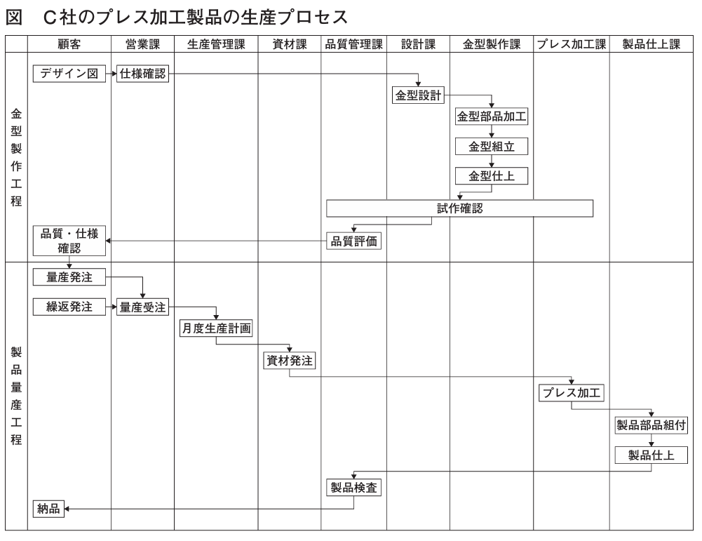

# Ａ社の事例

## 与件文

## 問題

【企業概要】

　①C社は1964 年創業、資本金2,500 万円、従業員60 名の金属製品製造業である。製品は、売上の7 割を占めるアルミニウムおよびステンレス製プレス加工製品（以下「プレス加工製品」という）と、残り3 割のステンレス製板金加工製品（以下「板金加工製品」という）である。プレス加工製品は金型を使用して成形する鍋、トレー、ポットなどの繰返受注製品で、板金加工製品は鋼材を切断や曲げ、溶接加工して製作する調理台、収納ラック、ワゴンなどの個別受注製品である。どちらもホテル、旅館、外食産業などの調理場で使用される製品で、業務用食器・什器の卸売企業2 社を販売先としている。

　②C社は、卸売企業が企画する業務用什器の板金加工製品を受託生産する企業として創業した。その後金属プレスや金型製作設備を導入してプレス加工製品の生産を始めている。難易度の高い金型製作技術の向上に努めて、ノウハウを蓄積してきたため、コスト低減や生産性向上に結びつく提案などが可能である。

　③近年は観光需要で受注量は毎年増加していたが、2020 年からの新型コロナウイルス感染拡大による外国人の新規入国規制や、外食産業の営業自粛による影響を受けて減少している。

【生産の現状】

　④生産部門は、生産管理課、資材課、設計課、金型製作課、プレス加工課、製品仕上課、板金加工課、品質管理課で構成されている。

　⑤プレス加工製品の生産プロセスには、金型を製作する金型製作工程と、その金型を利用して同じ製品の繰返受注生産を行う製品量産工程がある（次ページの図参照）。

　⑥C社の金型製作工程は、発注元から提示される形状やサイズの概要を表したデザイン図を基に仕様を確認した後に「金型設計」を行い、金型を構成する部品を製作する「金型部品加工」、加工した部品を組み立てる「金型組立」、その後の調整や研磨などを行う「金型仕上」を経て、「試作確認」を行い、さらに試作品の品質を発注元との間で確認して完成する。設計開始から完成までの金型製作期間は、難易度によって異なるが、短いもので約2週間、長いもので約1か月を要する。

　⑦「金型設計」は、設計課が2次元CAD を活用し担当している。発注元との仕様確認が遅くなることや、発注元からの設計変更、仕様変更の要請があり、設計期間が長くなることもある。また設計課では、個別受注の板金加工製品の製品設計も担当するため、設計業務の混乱が生じ金型製作期間全体に影響することもしばしば生じている。

　⑧「金型組立」、「金型仕上」は、プレス加工技術にも習熟するベテラン技能者が担当しているが、高齢化している。担当者は、金型の修理や改善作業も兼務し、製品の品質や製造コストに影響を及ぼす重要なスキルが必要なことから、若手の養成を検討している。

　⑧金型が完成した後の製品量産工程は、発注元から納品月の前月中旬に製品別の生産依頼数と納品指定日が通知され、それに基づいて前月月末までに「月度生産計画」を作成して「資材発注」する。プレス加工課では「プレス加工」を行い、製品仕上課で取っ手などの部品を組み付ける「製品部品組付」と製品の最終調整をする「製品仕上」を行い、通常月1 回発注元へ納品する。

　⑨C社の「プレス加工」は、生産能力に制約があり、C 社全体の生産進捗に影響している。プレス加工機ごとに担当する作業員が材料の出し入れと設備操作を行い、加工製品を変えるときには、その作業員が金型交換作業と材料準備作業など長時間の段取作業を一人で行っている。

　⑩プレス加工製品の生産計画は「プレス加工」の計画だけが立案され、「製品部品組付」、「製品仕上」はプレス加工終了順に作業する。生産計画は、各製品の1 日間の加工数量でそれぞれの基準日程を決めて立案する。以前は発注元もこれを理解して、C社の加工ロットサイズを基本に発注し、C 社で生産した全量を受領して、発注元で在庫対応していた。しかし、最近は発注元の在庫量削減方針によって発注ロットサイズが減少している。ただC 社では、基準日程によって設定しているロットサイズで加工を続け、確定受注量以外はC 社内で在庫している。

　⑪C社の受注から納品に至る社内業務では、各業務でパソコンを活用しているが、情報の交換と共有はいまだに紙ベースで行われている。

【新規製品事業】

　⑫数年前C社では受注拡大を狙って、雑貨・日用品の商談会に出展したことがある。その際商談成立には至らなかったが、中堅ホームセンターX 社から品質を高く評価された。今回そのX 社から新規取引の商談が持ち込まれた。

　⑬X社では、コロナ禍の2020 年以降も売上が順調に推移しているが、その要因の一つとしてアウトドア商品売上の貢献がある。しかし新型コロナウイルスのパンデミックにより、中国や東南アジア諸国企業に生産委託しているPB 商品の納品に支障が生じて、生産、物流など現在のサプライチェーンの維持が難しくなっている。また今後も海外生産委託商品の仕入れ価格の高騰が懸念されることから、生産委託先をC 社へ変更することについてC 社と相互に検討を行った。

　⑭C社社長は、当該事業の市場成長性と自社の強みを考慮して戦略とビジネスプロセスを見直し、積極的にこの事業に取り組むこととした。

　⑮X社の要請は、X 社のアウトドア用PB 商品のうち、中価格帯の食器セット、鍋、その他調理器具などアルミニウム製プレス加工製品の生産である。ただC 社社長は、今後高価格な製品に拡大することも期待している。

　⑯X社からの受注品は、商品在庫と店舗仕分けの機能を持つ在庫型物流センターへの納品となり、商品の発注・納品は、次のようになる。まず四半期ごとにX 社が商品企画と月販売予測を立案し、C 社に情報提供される。確定納品情報については、X社各店舗の発注データを毎週月曜日にX 社本社で集計する。在庫量からその集計数を差し引いて発注点に達した製品についてX 社の発注データがC 社に送付される。納期は発注日から7 日後の設定である。1 回の発注ロットサイズは、現状のプレス加工製品と比べるとかなり小ロットになる。

（令和4年度　中小企業診断士2次筆記試験　事例3　問題より引用）

### 第1問（配点20 点）

#### 問題文

2020年以降今日までの外部経営環境の変化の中で、C 社の販売面、生産面の課題を80字以内で述べよ。

#### ロジック

##### 現状分析

[plantuml]
----
@startmindmap

* 販売面
** コロナ禍による既存取引先からの受注量減少を補うため、新規販売先の開拓が必要。
*** コロナ禍により、ホテル旅館、外食産業は大きな影響を受けて、取引先からの受注量が減少している。
**** ①C社の製品は、ホテル、旅館、外食産業などの調理場で使用される製品で、業務用食器・什器の卸売企業を販売先としている。
**** ③2020年からの新型コロナウイルス感染拡大による外個人の入国規制や、外食産業の営業自粛による影響を受けて受注量が減少している。
*** コロナ禍でも売上が順調な企業から新規取引の商談が持ち込まれた。
**** ⑫数年前C社では受注拡大を狙って、雑貨・日用品の商談会に出店し、ホームセンターX社から新規取引の商談が持ち込まれた。
**** ⑬X社では、アウトドア商品売上の貢献により、2020年以降も売上が順調に推移している。コロナ禍により、海外生産からC社への生産委託の変更を検討している。
* 生産面
** 最近は、発注元から小ロット化や短納期化の要望があり、それらへの対応が必要。
*** ①売上の7割を占めるプレス加工製品は繰返受注製品で、残り3割の板金加工製品は個別受注製品である。
*** 最近は、発注元の意向によって、発注ロットサイズが従来よりも小ロットになってきている。
**** ⑩最近は発注元の在庫量削減方針によって（プレス加工製品の）発注ロットサイズが減少している。
**** ⑯（X社からの受注にあたって）1回の発注ロットサイズは、現状のプレス加工製品と比べるとかなり小ロットになる。
*** 従来は月1回の納品を行っていたが、X社からは短納期での納品が求められている。
**** ⑯(X社からの受注にあたって)納期は発注日から7日後の設定である。
**** ⑧（プレス加工製品の製品量産では）通常月1回発注元へ納品する。

@endmindmap
----

#### 解答

販売面では、コロナ禍による既存取引先の落ち込みをカバーする新規取引先開拓と高付加価値化。生産面では設計業務の遅れ、ベテラン技術者の高齢化、小ロット化への対応。

[markdown]
----
答案作成お疲れ様でした。それでは添削の結果をお伝えいたします。

論点1. 「2020年以降今日までの外部経営環境の変化」を踏まえているか

[含まれている項目] ：「コロナ禍により既存取引先からの受注が減少している」ということが記述できています。

[含まれていない項目] ：指摘事項はありません。

論点2. 販売面の課題を挙げているか

[含まれている項目] ：「新たな販売先を開拓することが必要」ということが記述できています。

[含まれていない項目] ：指摘事項はありません。

論点3. 生産面の課題を挙げているか

[含まれている項目] ：「小ロット化対応」について記述できています。

[含まれていない項目] ：「短納期化対応」についての記述が不足しています。

全体的に良くまとめられていますが、生産面の課題についてもう少し具体的に触れられるとより良いでしょう。今後の学習に向けて、引き続き頑張ってください。あなたの努力は必ず実を結びます。応援しています！
----

販売面では、コロナ禍による既存取引先の売上減少と新規取引先の開拓。生産面では、売上の7割を占めるプレス加工製品の小ロット対応と短納期への対応が課題。

[markdown]
----
答案作成お疲れ様でした。それでは添削の結果をお伝えいたします。

論点1. 「2020年以降今日までの外部経営環境の変化」を踏まえているか

[含まれている項目] ：「コロナ禍により既存取引先からの受注が減少している」ということが記述できています。

[含まれていない項目] ：指摘事項はありません。

論点2. 販売面の課題を挙げているか

[含まれている項目] ：「新たな販売先を開拓することが必要」ということが記述できています。

[含まれていない項目] ：指摘事項はありません。

論点3. 生産面の課題を挙げているか

[含まれている項目] ：「小ロット化対応」「短納期化対応」について記述できています。

[含まれていない項目] ：指摘事項はありません。

全体的に非常によくまとめられています。今後の学習に向けて、引き続き頑張ってください。あなたの努力は必ず実を結びます。応援しています！
----

### 第2問（配点20 点）

#### 問題文

C社の主力製品であるプレス加工製品の新規受注では、新規引合いから量産製品初回納品まで長期化することがある。しかし、プレス加工製品では短納期生産が一般化している。C社が新規受注の短納期化を図るための課題とその対応策を120字以内で述べよ。

#### ロジック

##### 現状分析

[plantuml]
----
@startmindmap

* プレス加工品の生産プロセス
** ⑤プレス加工製品の生産プロセスには、金型を製作する金型製作工程と、同じ製品の繰返受注生産を行う製品量産工程がある。
** ⑥金型製作工程は、金型設計、金型部品加工、金型組立、金型仕上、施策確認を行い、試作品の品質を発注元との間で確認して完成する。
* 金型設計
** ⑦金型設計は、設計課が2次元CADを活用し担当している。
** ⑦発注元の仕様確認が遅くなることや、発注元からの設計変更、仕様変更の要請があり、設計期間が長くなることもある。
** ⑦設計課では、個別受注の板金加工製品の製品設計も担当するため、設計業務の混乱が生じ金型製作期間全体に影響することも生じている。

@endmindmap
----

##### 課題設定

[plantuml]
----
@startmindmap

* プレス加工製品の新規受注における初回納品の短納期化
* 金型製作工程の中で、金型設計において、製作期間に影響を及ぼす問題が起きている。
* 金型設計にかかる期間の短縮が必要。

@endmindmap
----

##### 解決策

[plantuml]
----
@startmindmap

* 発注元との仕様確認に時間がかかり、設計変更や仕様変更も生じている。
** 3次元CADを導入することで、発注元との仕様確認の短期化や設計変更・仕様変更の減少を図ることができる。
* プレス加工製品と板金加工製品の製品設計を兼任しているため、設計業務の混乱が生じている。
** 設計課にて、プレス加工製品と板金加工製品の設計担当者を分けるなどして、役割分担を明確にする。

@endmindmap
----

#### 解答

課題として、①仕様確認の遅れ、仕様変更対応による設計業務長期化②個別受注の兼任による設計業務の混乱。対応策として、CADデータを活用し顧客とのやり取りを円滑にする、個別受注の専任担当者を割り当て進捗管理することで混乱を無くし業務効率を上げる。

[markdown]
----
答案作成お疲れ様でした。しっかりと考えられていることが伝わってきます。

それでは添削の結果をお伝えいたします。

論点1. 短期化が必要な工程と、課題について解答しているか。

[適切な部分] ： この論点について、適切な内容と評価できる記載は答案から読み取れませんでした。

[追加したい内容] ： 金型設計期間の短縮が課題となることを記載できると良いでしょう。

論点2. 新規受注の短納期化を図るための対応策を解答しているか。

[適切な部分] ：「CADデータを活用し顧客とのやり取りを円滑にする」という記載は、発注元との仕様確認を短期化するために3次元CADを導入することについて適切に記述されています。

[追加したい内容] ： プレス加工製品と板金加工製品の設計担当者を分けることが記述されていません。また、その理由として役割分担を明確にし、設計業務の混乱を防ぐためであることが記述できると良いでしょう。

総括コメント

全体的に課題と対応策について具体的に考えられている点は良いです。ただし、金型設計期間の短縮が課題であることや、設計担当者の役割分担についても触れると、より具体的で説得力のある答案になります。引き続き頑張ってください。
----

新規受注の短納期化を図るための課題は金型設計にかかる期間の短種であり、対応策は①３次元CADの導入により発注先との設計変更や仕様変更の減少を図る②設計課にて、プレス加工製品と板金加工製品の設計担当を分け役割分担を明確にする。

[markdown]
----
答案作成お疲れ様でした。しっかりと考えられていることが伝わってきます。

それでは添削の結果をお伝えいたします。

論点1. 短期化が必要な工程と、課題について解答しているか。

[適切な部分] ： 課題として「金型設計にかかる期間の短縮」を挙げている点は適切です。

[追加したい内容] ： 指摘事項はありません。必要な要素を充分に取り入れることができています。

論点2. 新規受注の短納期化を図るための対応策を解答しているか。

[適切な部分] ：「３次元CADの導入により発注先との設計変更や仕様変更の減少を図る」という記載は、発注元との仕様確認を短期化し、仕様変更の発生を減らすために3次元CADを導入することについて適切に記述されています。また、「設計課にて、プレス加工製品と板金加工製品の設計担当を分け役割分担を明確にする」という記載も、役割分担を明確にし、設計業務の混乱を防ぐための対応策として適切です。

[追加したい内容] ： 指摘事項はありません。必要な要素を充分に取り入れることができています。

総括コメント

全体的に課題と対応策について具体的に考えられており、非常に良い答案です。必要な要素を網羅的に含めることができていると言えます。この調子で引き続き頑張りましょう！
----

### 第3問（配点20 点）

#### 問題文

C社の販売先である業務用食器・什器卸売企業からの発注ロットサイズが減少している。また、検討しているホームセンターX 社の新規取引でも、1 回の発注ロットサイズはさらに小ロットになる。このような顧客企業の発注方法の変化に対応すべきC社の生産面の対応策を120字以内で述べよ。

#### ロジック

##### 現状分析

[plantuml]
----
@startmindmap

* 顧客企業の発注方法の変化
** ⑩最近は発注元の在庫量削減方針によって（プレス加工製品の）発注ロットサイズが減少している。
** ⑯（X社からの受注にあたって）1回の発注ロットサイズは、現状のプレス加工製品に比べるとかなり小ロットになる。
** ⑯X社からの受注品は、確定納品情報については、毎週月曜日に各店舗の発注データを集計して、C社に送付される。
* 製品量産工程
** ⑧製品量産工程は、発注元から納品月の前月中旬に生産依頼数などが通知され、それに基づいて「月度生産計画」を作成し資材発注している。
** ⑧プレス加工、製品部品組付け、製品仕上を行い、通常月1回発注元へ納品する。
* 生産計画
** ⑩プレス加工製品の生産計画は「プレス加工」だけが立案され、「製品部品組付」、「製品仕上」はプレス加工終了順に作業する。
** ⑩生産計画は、各製品の1日間の加工数量でそれぞれの基準日程を決めて立案する。以前は、発注元もC社の加工ロットサイズを基本に発注していた。
** ⑩（発注ロットサイズが減少しているが）C社では、基準日程によって設定しているロットサイズで加工を続け、確定受注量以外はC社内で在庫している。
* 小ロット化の影響
** ⑨プレス加工機にて、加工製品を変えるときには、担当の作業員が金型交換作業など長時間の段取り作業を一人で行っている。

@endmindmap
----

##### 課題設定

[plantuml]
----
@startmindmap

* 顧客企業からの発注ロットサイズの減少への生産面の対応

@endmindmap
----

##### 解決策

[plantuml]
----
@startmindmap

* C社の加工ロットサイズより発注ロットサイズが小さくなっている。
** 現在は確定受注量以外はC社内で在庫している。小ロット化が進むと対応しきれなくなる恐れがある。
*** 受注ロットサイズと加工ロットサイズを合わせた生産計画を作成する。

* 加工ロットサイズを小さくすることで、加工製品を変えるときの段取作業が多く発生する。
** 段取り作業は一人の作業員が長時間行っている。
*** 段取り作業を複数の作業員で行うようにして、加工作業の切替を迅速に行う。

* X社からは、週次で発注データが送られる。
** C社では月次で生産計画を作成しており、計画に反映できない。
*** 生産計画の作成サイクルを週次にする。
**** プレス加工だけでなく、製品部品組付や製品仕上も含めた生産計画を立てる必要がある。

@endmindmap
----

#### 解答

対応策として、①生産計画を見直し月1回納品を複数回にできるようにする。②基準日程を見直し設定しているロットサイズを小さくし社内在庫を減らす。③プレス加工工程の外段取り、IE適用、与力管理による改善により生産進捗や基準日程への影響を減らす。

[markdown]
----
答案作成お疲れ様でした。しっかりと考えられていることが伝わってきます。それでは添削の結果をお伝えいたします。

論点1. 発注ロットサイズの減少への対応策を解答しているか。

[適切な部分] ：「設定しているロットサイズを小さくし社内在庫を減らす。」という記述から、受注ロットサイズと加工ロットサイズを合わせること、適正なロットサイズで製造することについての記述ができていると言えます。

[追加したい内容] ：指摘事項はありません。必要な要素を充分に取り入れることができています。

論点2. 生産計画に関する対応策を解答しているか。

[適切な部分] ：「生産計画を見直し月1回納品を複数回にできるようにする。」という記述は、生産計画の作成サイクルを短縮する内容の記述が適切にできていると言えます。

[追加したい内容] ：製品部品組付や製品仕上の生産計画を作成することについての記述が含まれていると、より具体的な答案になるでしょう。

論点3. 段取作業が増えることに対する対応策を解答しているか。

[適切な部分] ：「プレス加工工程の外段取り、IE適用、与力管理による改善により生産進捗や基準日程への影響を減らす。」という記述は、段取作業の効率化に触れていると言えます。

[追加したい内容] ：段取作業を複数の作業員で担当することや、加工製品の切替を迅速にできるようにすることが記載できると良いでしょう。

総括コメント 全体的に、C社の生産面の対応策について考えられていることが伝わってきます。ただし、製品部品組付や製品仕上の生産計画についても触れると、より具体的な答案になるでしょう。引き続き頑張りましょう！
----

### 第4問（配点20 点）

#### 問題文

C社社長は、ホームセンターX社との新規取引を契機として、生産業務の情報の交換と共有についてデジタル化を進め、生産業務のスピードアップを図りたいと考えている。C社で優先すべきデジタル化の内容と、そのための社内活動はどのように進めるべきか、120字以内で述べよ。

#### ロジック

##### 現状分析

[plantuml]
----
@startmindmap

* X社との取引における情報
** ⑯四半期ごとにX社が商品企画と月販売予測を立案し、C社に情報提供される。確定納品情報は、毎週月曜日に各店舗の発注データを集計して、C社に送付される。
* C社のデジタル化の状況
** ⑪C社の受注から納品に至る社内業務では、各業務でパソコンを活用しているが、情報の交換と共有はいまだに紙ベースで行われている。
* 社内活動について
** ⑧ベテラン技能者が高齢化しており、製品の品質や製造コストに影響を及ぼす重要なスキルが必要なことから、若手の養成を検討している。

@endmindmap
----

##### 課題設定

[plantuml]
----
@startmindmap

* C社で優先すべきデジタル化の内容と、そのための社内活動をどのように進めるべきか。

@endmindmap
----

##### 解決策

[plantuml]
----
@startmindmap

* 優先すべきデジタル化の内容
** 情報をデータベース化してリアルタイムに共有できるようにする。
*** 情報の交換と共有に時間がかかっている。
**** 社内の情報の交換と共有は紙ベースで行われている。
*** X社からはC社に発注データが送付される。
** 対象となる生産情報は、受注データ、CADの設計データ、生産計画およびその進捗情報など。
* 社内活動をどのように進めるか
** C社は若手の養成が必要な状況
*** 若手を中心としたプロジェクトチームを作って、業務プロセスの見直しやデジタル化を進める。
** 生産情報は、営業課や生産部門の各課に広く関わる情報。
*** 全社横断的なプロジェクトとして業務プロセスの見直しを行う。

@endmindmap
----

#### 解答

デジタル化の内容として、設計データと顧客とのやり取りの営業課との共有、ベテラン技術者の持つ作業天順やノウハウの文書化である。進め方として若手社員を中心としてプロジェクトチームを組み高齢社員のサポートをしながら知識、技術の継承を進めていく。

[markdown]
----
答案作成お疲れ様でした。しっかりと考えられていることが伝わってきます。それでは添削の結果をお伝えいたします。

論点1. 優先すべきデジタル化の内容について解答しているか。

[適切な部分] ： この論点について、適切な内容と評価できる記載は答案から読み取れませんでした。

[追加したい内容] ： 「生産情報のデータベース化を優先すべき」という具体的な内容が含まれていると良いです。

論点2. データベース化する生産情報を挙げているか。

[適切な部分] ：「顧客とのやり取りの営業課との共有」という記述があり、顧客からの受発注情報が含まれています。

[追加したい内容] ： CADの設計データ、生産計画、生産の進捗情報といった、具体的な生産情報の内容のいずれかが含まれているとより良くなるでしょう。

論点3. デジタル化を推進するための社内活動はどのように進めるべきかを解答しているか。

[適切な部分] ：「若手社員を中心としてプロジェクトチームを組み」という記述があり、若手メンバーを中心としたプロジェクトチームを構築することが示されています。

[追加したい内容] ：「全社横断的に進める」といった具体的な進め方が含まれているとより良いです。

総括コメント： 全体的にしっかりとした内容が含まれており、特に若手社員を中心としたプロジェクトチームの構築については明確に示されています。さらに具体的な生産情報のデータベース化や、全社横断的な進め方を追加することで、より充実した答案になるでしょう。引き続き頑張ってください。
----

### 第5問（配点20 点）

#### 問題文

C社社長が積極的に取り組みたいと考えているホームセンターX社との新規取引に応えることは、C社の今後の戦略にどのような可能性を持つのか、中小企業診断士として100 字以内で助言せよ。

#### ロジック

##### 現状分析

[plantuml]
----
@startmindmap

* 今後の戦略の可能性
** 高度な金型製作技術の強みを活かして、高価格帯のプレス加工製品の生産・販売への拡大が期待できる。
*** X社との新規取引の位置づけ
**** ⑭C社社長は、当該事業の市場成長性と自社の強みを考慮して戦略とビジネスプロセスを見直し、積極的にこの事業に取り組むこととした。
**** ⑮X社の要請は、中価格帯のプレス加工製品の生産であるが、C社社長は、今後高価格な製品に拡大することも期待している。
*** C社の強み
**** ②難易度の高い金型製作技術の向上に務めて、ノウハウを蓄積してきたため、コスト低減や生産性向上に結びつく提案などが可能である。
** コロナ禍による既存取引先からの受注量減少を補うため、新規販売先の開拓が必要。
** アウトドア商品市場や海外生産委託からの切替を検討している企業に対して、提案力を活かしてX社以外の新たな取引先を開拓できる。
*** C社の強み
**** ②難易度の高い金型製作技術の向上に努めて、ノウハウを蓄積してきたため、コスト低減や生産性向上に結びつく提案などが可能である。
*** 市場成長性
**** ⑬X社では、アウトドア商品売上の貢献により、2020年以降も売上が順調に推移している。
**** ⑬X社では、今後も海外生産委託商品の仕入れ価格の高騰が懸念されることから、生産委託先をC社へ変更することについて検討を行った。

@endmindmap
----

#### 解答

X社との新規取引に応えることコロナ禍で影響を受けている既存市場のリスクを分散でき成長市場に参入できる。また、自社の強みである金型製作技術、コスト低減や生産性向上の提案により高価格帯製品受注が期待できる。

[markdown]
----
答案作成お疲れ様でした。以下に、あなたの答案について評価を行います。

論点1. C社の強みに着目しているか

[含まれている項目] ：難易度の高い金型製作技術／コスト低減や生産性向上に結びつく提案力

[含まれていない項目] ：指摘事項はありません

論点2. 事業の市場成長性に着目しているか

[含まれている項目] ：アウトドア商品の売上が好調

[含まれていない項目] ：生産委託先の切替を検討

論点3. X社との新規取引に応えることによる、C社の今後の戦略の可能性を挙げられているか

[含まれている項目] ：強みの金型製作技術を活かす／高価格帯のプレス加工製品の生産・販売に拡大する／強みの提案力を活かす

[含まれていない項目] ：アウトドア商品市場や海外生産委託をしている企業を新規取引先として開拓する

コメント： 全体的に良い内容が含まれていますが、事業の市場成長性に関する具体的な情報がもう少し含まれているとさらに良いでしょう。今後の学習に向けて、引き続き頑張ってください。あなたの努力が実を結ぶことを期待しています。
----
