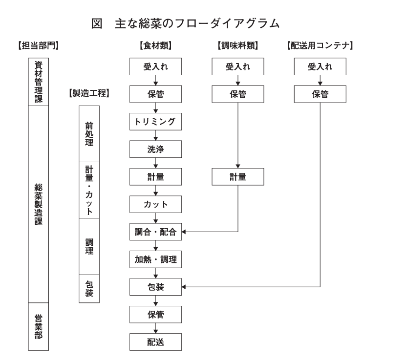

# Ａ社の事例

## 与件文

【企業概要】
C社は資本金3,000万円、従業員60名（うちパート従業員40名）の業務用食品製造業である。現在の組織は、総務部４名、配送業務を兼務する営業部６名、最近新設した製品開発部２名、製造部48名で構成されている。パート従業員は全て製造部に配置されている。 　C社は地方都市に立地し、温泉リゾート地にある高級ホテルと高級旅館５軒を主な販売先として、販売先の厨房の管理を担う料理長（以下、販売先料理長という）を通じて依頼がある和食や洋食の総菜、菓子、パン類などの多品種で少量の食品を受託製造している。 　高級ホテルの料理人を経験し、ホテル調理場の作業内容などのマネジメントに熟知した現経営者が、ホテル内レストランメニューの品揃えの支援を行う調理工場を標ぼうして1990年にC社を創業した。近年、販売先のホテルや旅館では、増加する訪日外国人観光客の集客を狙って、地元食材を使った特色のあるメニューを提供する傾向が強まっているが、その一方で材料調達や在庫管理の簡素化などによるコスト低減も目指している。そのためもあり、C社の受注量は年々増加してきた。 　2020年からの新型コロナウイルスのパンデミックの影響を受け、C社の受注量は激減していたが、最近では新型コロナウイルス感染も落ち着き、観光客の増加によって販売先のホテルや旅館の稼働率が高くなり、受注量も回復してきている。

【生産の現状】
C社の製造部は、生産管理課、総菜製造課、菓子製造課、資材管理課で構成されている。総菜製造課には５つの総菜製造班、菓子製造課には菓子製造とパン製造の２つの班があり、総菜製造班は販売先ごとに製造を行っている。各製造班にはベテランのパートリーダーが各１名、その下にはパート従業員が配置されている。製造部長、総菜製造課長、菓子製造課長（以下、工場管理者という）は、ホテルや旅館での料理人の経験がある。 　C社の工場は、製造班ごとの加工室に分離され、食品衛生管理上交差汚染を防ぐようゾーニングされているが、各加工室の設備機器のレイアウトはホテルや旅館の厨房と同様なつくりとなっている。 　受注量が最も多い総菜の製造工程は、食材の不用部トリミングや洗浄を行う前処理、食材の計量とカットや調味料の計量を行う計量・カット、調味料を入れ加熱処理する調理があり、鍋やボウル、包丁など汎用調理器具を使って手作業で進められている。 　C社の製造は、販売先から指示がある製品仕様に沿って、工場管理者３名と各製造班のパートリーダーがパート従業員に直接作業方法を指導、監督して行われている。 　C社が受託する製品は、販売先のホテルや旅館が季節ごとに計画する料理メニューの中から、その販売先料理長が選定する食品で、その食材、使用量、作業手順などの製品仕様は販売先料理長がC社に来社し、口頭で直接指示を受けて試作し決定する。また納入期間中も販売先料理長が来社し、製品の出来栄えのチェックをし、必要があれば食材、製造方法などの変更指示がある。その際には工場管理者が立ち会い、受託製品の製品仕様や変更の確認を行っている。毎日の生産指示や加工方法の指導などは両課長が加工室で直接行う。

　販売先料理長から口頭で指示される各製品の食材、使用量、作業手順などの製品仕様は、工場管理者が必要によってメモ程度のレシピ（レシピとは必要な食材、その使用量、料理方法を記述した文書）を作成し活用していたが、整理されずにいる。

　受託する製品の仕様が決定した後は、C社の営業部員が担当する販売先料理長から翌月の月度納品予定を受け、製造部生産管理課に情報を伝達、生産管理課で月度生産計画を作成し、総菜製造課長、菓子製造課長に生産指示する。両製造課長は月度生産計画に基づき製造日ごとの作業計画を作成しパートリーダーに指示する。パートリーダーは、月度生産計画に必要な食材や調味料の必要量を経験値で見積り、長年取引がある食品商社に月末に定期発注する。食品商社は、C社の月度生産計画と食材や調味料の消費期限を考慮して納品する。食材や調味料の受入れと、常温、冷蔵、冷凍による在庫の保管管理は資材管理課が行っているが、入出庫記録がなく、食材や調味料の在庫量は増える傾向にあり、廃棄も生じる。また製造日に必要な食材や調味料は前日準備するが、その時点で納品遅れが判明し、販売先に迷惑をかけたこともある。

販売先への日ごとの納品は、宿泊予約数の変動によって週初めに修正し確定する。朝食用製品については販売先消費日の前日午後に製造し当日早朝に納品する。夕食用製品については販売先消費日の当日14:00までに製造し納品する。

【新規事業】

現在、C社所在地周辺で多店舗展開する中堅食品スーパーX社と総菜商品の企画開発を共同で行っている。X社では、各店舗の売上金額は増加しているが、総菜コーナーの売上伸び率が低く、X社店舗のバックヤードでの調理品の他に、中食需要に対応する総菜の商品企画を求めている。C社では、季節性があり高級感のある和食や洋食の総菜などで、X社の既存の総菜商品との差別化が可能な商品企画を提案している。C社の製品開発部は、このために外部人材を採用し最近新設された。この採用された外部人材は、中堅食品製造業で製品開発の実務や管理の経験がある。

この新規事業では、季節ごとにX社の商品企画担当者とC社で商品を企画し、X社が各月販売計画を作成する。納品数量は納品日の２ 日前に確定する。納品は商品の鮮度を保つため最低午前と午後の配送となる。X社としては、当初は客単価の高い数店舗から始め、10数店舗まで徐々に拡大したい考えである。

C社社長は、この新規事業に積極的に取り組む方針であるが、現在の生産能力では対応が難しく、工場増築などによって生産能力を確保する必要があると考えている。

## 問題

### 第1問（配点10 点）

#### 問題文

C社の生産面の強みを2つ40字以内で述べよ。

#### ロジック

##### 現状分析

[plantuml]
----
@startmindmap

* 販売先からの多品種少量生産などの要求に細やかに対応できる生産設備や体制。
** 多品種少量生産に対応できている。
*** 高級ホテルや高級旅館を主な販売先として、多品種で少量の食品を受託製造している。
*** ホテル内のレストランメニューの品揃えの支援を行う調理工場を標榜して創業。
** 販売先から要望に対応しやすい設備。
*** 各加工室の設備機器のレイアウトはホテルや旅館の厨房と同様のつくりとなっている。
** 販売先からの高い要求水準に対応できる。
*** 受託する製品の仕様は、販売先料理長からの直接指示を受ける。販売先料理長が出来栄えをチェックし、変更指示がある。
** 製造する食品の安全性を高める対策がなされている。
*** 工場は、製造班ごとの加工室に分離され、交差汚染を防ぐようゾーニングされている。
* 経営者は、調理場の作業内容のマネジメントに熟知。
** 高級ホテルの料理人を経験し、ホテル調理場の作業内容などのマネジメントに熟知した現経営者。
* 料理人経験のある工場管理者やベテランのパート従業員の指導・監督により、販売先からの要求に対応。
** 料理人経験のある工場管理者がいる。
*** 製造部長などの工場経験者は、ホテルや旅館での料理人の経験がある。
** ベテランのパート従業員がいる。
*** 各製造班にはベテランのパートリーダーが配置されている。
** 製造は、工場管理者とパートリーダーがパート従業員に直接作業方法を指導、監督する。

@endmindmap
----

##### 課題設定

[plantuml]
----
@startmindmap

@endmindmap
----

##### 解決策

[plantuml]
----
@startmindmap

@endmindmap
----
#### 解答

### 第2問（配点20 点）

#### 問題文

C社の製造部では、コロナ禍で受注量が減少した2020年以降の工場稼働の低下による出勤日数調整の影響で、高齢のパート従業員も退職し、最近の増加する受注量の対応に苦慮している。生産面でどのような対応策が必要なのか、100字以内で述べよ。

#### ロジック

##### 現状分析

[plantuml]
----
@startmindmap

* 新型コロナウィルスの影響を受け、C社の受注量は激減していたが、最近では受注量も回復してきている。
* 受注量が最も多い惣菜の製造工程は、前処理、計量・カット、加熱処理があり、汎用調理器具を使って手作業で進められている。
* 受託する製品の仕様は、販売先料理長から口頭で直接指示を受ける。
* 販売先料理長から口頭で指示される製品仕様は、工場管理者が必要によってメモ程度のレシピを作成し活用していたが、整理されずにいる。
* 製造は、工場管理者とパートリーダーがパート従業員に直接作業方法を指導、監督する。

@endmindmap
----

##### 課題設定

[plantuml]
----
@startmindmap

* パート従業員の退職により増加する受注量に対応しきれていない。
* 増加する受注量に対応する、生産面での対応策。

@endmindmap
----

##### 解決策

[plantuml]
----
@startmindmap

* 受注量が多い惣菜の製造工程にて、処理が手作業。
** 手作業で行っていた処理について、専用調理器具の導入による機械化を進める。
** 従来より小さい人数で処理を製造できる。
* 販売先料理長から製品仕様について口頭で指示。
** 工場管理者がメモ程度のレシピを作成するが整理されていない。
** 工場管理者などからパート従業員に直接指導、監督しているが、効率が良くない。
** レシピを体系的に整理して、パート従業員が参照できるようにする。
** パート従業員の作業や、パートへの指導・監督などを効率よく進められる。

@endmindmap
----

#### 解答

### 第3問（配点20 点）

#### 問題文

C社では、最近の材料価格高騰の影響が大きく、付加価値が高い製品を販売しているものの、収益性の低下が生じている。どのような対応策が必要なのか、120字以内で述べよ。

#### ロジック

##### 現状分析

[plantuml]
----
@startmindmap

@endmindmap
----

##### 課題設定

[plantuml]
----
@startmindmap

@endmindmap
----

##### 解決策

[plantuml]
----
@startmindmap

@endmindmap
----

#### 解答

### 第4問（配点20 点）

#### 問題文

C社社長は受注量が低迷した数年前から、既存の販売先との関係を一層密接にするとともに、他のホテルや旅館への販路拡大を図るため、自社企画製品の製造販売を実現したいと思っていた。また、食品スーパーX社との新規事業でも総菜の商品企画が必要となっている。創業から受託品の製造に特化してきたC社は、どのように製品の企画開発を進めるべきなのか、120字以内で述べよ。

#### ロジック

##### 現状分析

[plantuml]
----
@startmindmap

@endmindmap
----

##### 課題設定

[plantuml]
----
@startmindmap

@endmindmap
----

##### 解決策

[plantuml]
----
@startmindmap

@endmindmap
----

#### 解答

### 第5問（配点30 点）

#### 問題文

食品スーパーX社と共同で行っている総菜製品の新規事業について、C社社長は現在の生産能力では対応が難しいと考えており、工場敷地内に工場を増築し、専用生産設備を導入し、新規採用者を中心とした生産体制の構築を目指そうとしている。このC社社長の構想について、その妥当性とその理由、またその際の留意点をどのように助言するか、140字以内で述べよ。

#### ロジック

##### 現状分析

[plantuml]
----
@startmindmap

@endmindmap
----

##### 課題設定

[plantuml]
----
@startmindmap

@endmindmap
----

##### 解決策

[plantuml]
----
@startmindmap

@endmindmap
----

#### 解答

